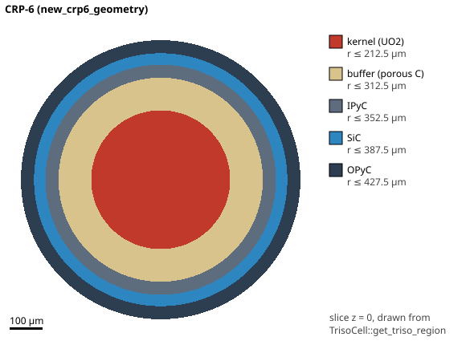
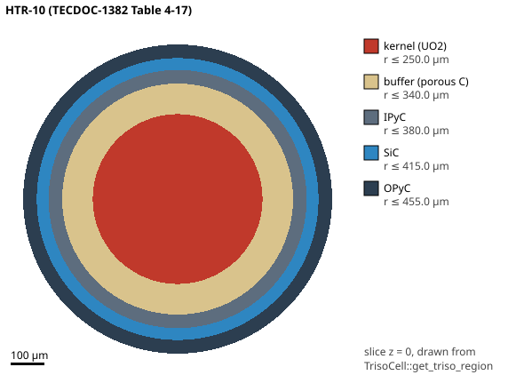

# Rung 1 — The particle: five layers

> **Research, education and V&V only.** Nothing here is for reactor
> operation, licensing, safety-critical decisions or emergency response
> ([`RESPONSIBLE_USE.md`](https://github.com/theodoreOnzGit/outram-park-backend/blob/@@COMMIT@@/RESPONSIBLE_USE.md)).
> **Review status:** AI-assisted draft, 2026-10-04, not yet human-reviewed.
> [Something doesn't tally?](https://github.com/theodoreOnzGit/outram-park-backend/issues/new?title=boon-lay%20lesson%20rung%201%20doesn%27t%20tally)

**Core lesson, rung 1 of 8.** Shared with the Monte Carlo track: its rung 5
(TRISO and HTR-10, gh:#528) links to [the five layers](#the-five-layers)
below for what each layer is for.

## The hook

Open the [TRISO pebble demo](../../demos/triso-pebble/). Neutrons fly through
a fuel pebble, and the pebble is full of grains. Each grain is a **TRISO
particle**, under a millimetre across. A fission inside one makes two new
atoms, and some of them are radioactive.

> **The problem.** A high-temperature gas-cooled reactor has no metal
> cladding. The particles themselves are the containment. *What is in a
> particle, and how does this crate describe it?*

**Demo:** [open this rung](../../demos/triso-atops/?rung=triso). The CRP-6 or HTR-10 particle drawn
in your browser from 200 × 200 region lookups on the assembled `TrisoCell`
(step 2's lookup); tap it to name a layer. The illustrations on this page
are small JavaScript drawings, labelled as such.

---

## Step 1. What is in a TRISO particle? {#the-five-layers}

**The question.** A grain under a millimetre across is supposed to keep
fission products in for years, at up to about 1600 °C in an accident. How is
it built?

**The shortest answer.** Five concentric spheres: a fuel kernel, then four
coatings, each with one job.

| Layer | What it is | Its job |
|---|---|---|
| **Kernel** | UO₂ (here), a few hundred µm across | the fuel; fission products are born in it |
| **Buffer** | porous carbon, about 50 % voids | room for fission gas; absorbs the recoiling fission fragments |
| **IPyC** | dense pyrolytic carbon | seals the kernel; a smooth base for the SiC |
| **SiC** | silicon carbide | **the pressure vessel** and the main diffusion barrier |
| **OPyC** | dense pyrolytic carbon | protects the SiC; bonds the particle into the graphite matrix |

**The formula.** Each layer is a spherical shell, so its volume is

$$V_i = \frac{4}{3}\pi\left(r_i^3 - r_{i-1}^3\right).$$

The volume that matters most later is the gas space. The PANAMA-I report
takes it as half the buffer shell, $V_f = \frac{1}{2} V_{\text{buffer}}$, and
the crate's HTR-10 application does the same
([`free_volume`](https://github.com/theodoreOnzGit/outram-park-backend/blob/@@COMMIT@@/crates/boon-lay/src/fuel_failure/htr10/mod.rs#@@L:crates/boon-lay/src/fuel_failure/htr10/mod.rs:fn=free_volume@@)).

**The illustration** (JavaScript, drawn from the radii below; tap a layer to
name it):

<div class="bl-anim" data-anim="layers"></div>

**The code walk.** The random-walk model builds the particle as five CSG
spheres, a
[`TrisoCell`](../../api/boon_lay/lagrangian_decay_simulator/lagrangian_diffusion/single_particle_simulator/constructive_solid_geometry/struct.TrisoCell.html).
Its standard instance is the CRP-6 geometry:

*In words, read from the source by hand:*

<!-- walk-in-words: from=crates/boon-lay/src/lagrangian_decay_simulator/lagrangian_diffusion/single_particle_simulator/constructive_solid_geometry/mod.rs::new_crp6_geometry to=crates/boon-lay/src/lagrangian_decay_simulator/lagrangian_diffusion/single_particle_simulator/constructive_solid_geometry/mod.rs::new_sphere -->
1. [`TrisoCell::new_crp6_geometry`](https://github.com/theodoreOnzGit/outram-park-backend/blob/@@COMMIT@@/crates/boon-lay/src/lagrangian_decay_simulator/lagrangian_diffusion/single_particle_simulator/constructive_solid_geometry/mod.rs#@@L:crates/boon-lay/src/lagrangian_decay_simulator/lagrangian_diffusion/single_particle_simulator/constructive_solid_geometry/mod.rs:fn=new_crp6_geometry@@): turns a 425 µm kernel *diameter* and four thicknesses into five radii.
2. → [`TrisoCell::new`](https://github.com/theodoreOnzGit/outram-park-backend/blob/@@COMMIT@@/crates/boon-lay/src/lagrangian_decay_simulator/lagrangian_diffusion/single_particle_simulator/constructive_solid_geometry/mod.rs#@@L:crates/boon-lay/src/lagrangian_decay_simulator/lagrangian_diffusion/single_particle_simulator/constructive_solid_geometry/mod.rs:fn=new@@): asserts the radii are nested, sets every layer to 1600 °C and the fluence to zero.
3. → [`Region::new_sphere`](https://github.com/theodoreOnzGit/outram-park-backend/blob/@@COMMIT@@/crates/boon-lay/src/lagrangian_decay_simulator/lagrangian_diffusion/single_particle_simulator/constructive_solid_geometry/mod.rs#@@L:crates/boon-lay/src/lagrangian_decay_simulator/lagrangian_diffusion/single_particle_simulator/constructive_solid_geometry/mod.rs:fn=new_sphere@@), five times, all centred at the origin.
<!-- /walk-in-words -->

*Generated by rust-analyzer (`kovan-cli code-walk`); a hop it cannot follow is marked, and a hop filled by hand is labelled:*

<!-- code-walk: from=crates/boon-lay/src/lagrangian_decay_simulator/lagrangian_diffusion/single_particle_simulator/constructive_solid_geometry/mod.rs::new_crp6_geometry to=crates/boon-lay/src/lagrangian_decay_simulator/lagrangian_diffusion/single_particle_simulator/constructive_solid_geometry/mod.rs::new_sphere -->
<!-- generated by `kovan-cli code-walk-check --update`; edit the comment above, not this -->

Call chain from `mod.rs::TrisoCell::new_crp6_geometry` to `mod.rs::Region::new_sphere`: 2 hops, 1 shortest chain. Each step shows its code; the name links to it on GitHub.

**1.** [`mod.rs::TrisoCell::new_crp6_geometry`](https://github.com/theodoreOnzGit/outram-park-backend/blob/@@COMMIT@@/crates/boon-lay/src/lagrangian_decay_simulator/lagrangian_diffusion/single_particle_simulator/constructive_solid_geometry/mod.rs#L137) — gotten typical triso geometry from: Hales, J.

<!-- snippet-check: crates/boon-lay/src/lagrangian_decay_simulator/lagrangian_diffusion/single_particle_simulator/constructive_solid_geometry/mod.rs:137 fn new_crp6_geometry -->
<!-- snippet-check: crates/boon-lay/src/lagrangian_decay_simulator/lagrangian_diffusion/single_particle_simulator/constructive_solid_geometry/mod.rs:151 new -->

```rust,ignore
{{#include ../../../../../crates/boon-lay/src/lagrangian_decay_simulator/lagrangian_diffusion/single_particle_simulator/constructive_solid_geometry/mod.rs:137:152}}
    // … (the rest of the function: follow the link above)
```

**2.** → [`mod.rs::TrisoCell::new`](https://github.com/theodoreOnzGit/outram-park-backend/blob/@@COMMIT@@/crates/boon-lay/src/lagrangian_decay_simulator/lagrangian_diffusion/single_particle_simulator/constructive_solid_geometry/mod.rs#L84) · called at [L151](https://github.com/theodoreOnzGit/outram-park-backend/blob/@@COMMIT@@/crates/boon-lay/src/lagrangian_decay_simulator/lagrangian_diffusion/single_particle_simulator/constructive_solid_geometry/mod.rs#L151) — creates a new triso cell based on the radii

<!-- snippet-check: crates/boon-lay/src/lagrangian_decay_simulator/lagrangian_diffusion/single_particle_simulator/constructive_solid_geometry/mod.rs:84 fn new -->
<!-- snippet-check: crates/boon-lay/src/lagrangian_decay_simulator/lagrangian_diffusion/single_particle_simulator/constructive_solid_geometry/mod.rs:100 new_sphere -->

```rust,ignore
{{#include ../../../../../crates/boon-lay/src/lagrangian_decay_simulator/lagrangian_diffusion/single_particle_simulator/constructive_solid_geometry/mod.rs:84:101}}
    // … (the rest of the function: follow the link above)
```

**3.** → [`mod.rs::Region::new_sphere`](https://github.com/theodoreOnzGit/outram-park-backend/blob/@@COMMIT@@/crates/boon-lay/src/lagrangian_decay_simulator/lagrangian_diffusion/single_particle_simulator/constructive_solid_geometry/mod.rs#L17) · called at [L100](https://github.com/theodoreOnzGit/outram-park-backend/blob/@@COMMIT@@/crates/boon-lay/src/lagrangian_decay_simulator/lagrangian_diffusion/single_particle_simulator/constructive_solid_geometry/mod.rs#L100)

<!-- snippet-check: crates/boon-lay/src/lagrangian_decay_simulator/lagrangian_diffusion/single_particle_simulator/constructive_solid_geometry/mod.rs:17 fn new_sphere -->

```rust,ignore
{{#include ../../../../../crates/boon-lay/src/lagrangian_decay_simulator/lagrangian_diffusion/single_particle_simulator/constructive_solid_geometry/mod.rs:17:26}}
```
<!-- /code-walk -->

*Everything this entry point reaches is in the
[call-tree appendix](../../deep-dives/triso-atops/call-trees.html#rung-1).*

```rust,ignore
{{#include ../../../src/lagrangian_decay_simulator/lagrangian_diffusion/single_particle_simulator/constructive_solid_geometry/mod.rs:137:157}}
```

That gives radii 212.5, 312.5, 352.5, 387.5 and 427.5 µm. The geometry is
cited in the code to Hales et al. (2013, *J. Nucl. Mater.* 443), and it is
the one used by the IAEA CRP-6 benchmark cases this crate checks against.
Each region also carries a temperature (1600 °C by default, case 3a of Hales
et al. 2021) and one fast-neutron fluence for the whole particle (zero by
default).

**Predict.** Which layer would you expect to fail first if the gas pressure
inside keeps rising: the porous buffer, or the SiC? Why does the answer
depend on which layer is *strong*, not which is *inside*?

---

## Step 2. Given a point, which layer is it in?

**The question.** A random walk (rung 3) moves an atom to a new point. The
code then needs the layer at that point, to know how fast the atom diffuses
there.

**The shortest answer.** Compute the distance from the centre and compare it
with the five radii, innermost first. A point exactly on an interface
belongs to the **outer** layer.

**The formula.** $r = \sqrt{x^2 + y^2 + z^2}$; the region is the first $i$
with $r < r_i - \varepsilon$, with $\varepsilon = 10^{-12}$ m.

**The code walk.** There are two lookups, and the walk shows both:

*In words, read from the source by hand:*

<!-- walk-in-words: from=crates/boon-lay/src/lagrangian_decay_simulator/lagrangian_diffusion/single_particle_simulator/constructive_solid_geometry/mod.rs::try_get_diffusion_coefficient to=crates/boon-lay/src/lagrangian_decay_simulator/lagrangian_diffusion/single_particle_simulator/constructive_solid_geometry/sphere.rs::point_in_sphere -->
- **Branch A, "which region?"** [`TrisoCell::get_triso_region`](https://github.com/theodoreOnzGit/outram-park-backend/blob/@@COMMIT@@/crates/boon-lay/src/lagrangian_decay_simulator/lagrangian_diffusion/single_particle_simulator/constructive_solid_geometry/mod.rs#@@L:crates/boon-lay/src/lagrangian_decay_simulator/lagrangian_diffusion/single_particle_simulator/constructive_solid_geometry/mod.rs:fn=get_triso_region@@)
  → [`Region::try_return_center_and_radius_of_sphere`](https://github.com/theodoreOnzGit/outram-park-backend/blob/@@COMMIT@@/crates/boon-lay/src/lagrangian_decay_simulator/lagrangian_diffusion/single_particle_simulator/constructive_solid_geometry/mod.rs#@@L:crates/boon-lay/src/lagrangian_decay_simulator/lagrangian_diffusion/single_particle_simulator/constructive_solid_geometry/mod.rs:fn=try_return_center_and_radius_of_sphere@@)
  (five times), then the `if r < r_fuel - eps` ladder. Returns a `TrisoRegion`.
- **Branch B, "what is D here?"** [`TrisoCell::try_get_diffusion_coefficient`](https://github.com/theodoreOnzGit/outram-park-backend/blob/@@COMMIT@@/crates/boon-lay/src/lagrangian_decay_simulator/lagrangian_diffusion/single_particle_simulator/constructive_solid_geometry/mod.rs#@@L:crates/boon-lay/src/lagrangian_decay_simulator/lagrangian_diffusion/single_particle_simulator/constructive_solid_geometry/mod.rs:fn=try_get_diffusion_coefficient@@)
  → [`Region::is_within_region`](https://github.com/theodoreOnzGit/outram-park-backend/blob/@@COMMIT@@/crates/boon-lay/src/lagrangian_decay_simulator/lagrangian_diffusion/single_particle_simulator/constructive_solid_geometry/mod.rs#@@L:crates/boon-lay/src/lagrangian_decay_simulator/lagrangian_diffusion/single_particle_simulator/constructive_solid_geometry/mod.rs:fn=is_within_region@@)
  → [`Sphere::is_point_in_sphere`](https://github.com/theodoreOnzGit/outram-park-backend/blob/@@COMMIT@@/crates/boon-lay/src/lagrangian_decay_simulator/lagrangian_diffusion/single_particle_simulator/constructive_solid_geometry/sphere.rs#@@L:crates/boon-lay/src/lagrangian_decay_simulator/lagrangian_diffusion/single_particle_simulator/constructive_solid_geometry/sphere.rs:fn=is_point_in_sphere@@)
  → `point_in_sphere` (`dist² < (r − ε)²`, `ε = max(10⁻¹⁰ r, 10⁻¹² m)`), tested innermost first;
  the first sphere that contains the point picks the layer's material and
  temperature, and the walk continues to
  [`try_get_diffusion_coeff_jiang`](./layers.md#step-1-how-fast-does-an-atom-move-in-each-layer) (rung 4).
<!-- /walk-in-words -->

*Generated by rust-analyzer (`kovan-cli code-walk`); a hop it cannot follow is marked, and a hop filled by hand is labelled:*

<!-- code-walk: from=crates/boon-lay/src/lagrangian_decay_simulator/lagrangian_diffusion/single_particle_simulator/constructive_solid_geometry/mod.rs::try_get_diffusion_coefficient to=crates/boon-lay/src/lagrangian_decay_simulator/lagrangian_diffusion/single_particle_simulator/constructive_solid_geometry/sphere.rs::point_in_sphere -->
<!-- generated by `kovan-cli code-walk-check --update`; edit the comment above, not this -->

Call chain from `mod.rs::TrisoCell::try_get_diffusion_coefficient` to `sphere.rs::point_in_sphere`: 3 hops, 1 shortest chain. Each step shows its code; the name links to it on GitHub.

**1.** [`mod.rs::TrisoCell::try_get_diffusion_coefficient`](https://github.com/theodoreOnzGit/outram-park-backend/blob/@@COMMIT@@/crates/boon-lay/src/lagrangian_decay_simulator/lagrangian_diffusion/single_particle_simulator/constructive_solid_geometry/mod.rs#L213) — checks the diffusion coefficient based on coordinates of the triso particle

<!-- snippet-check: crates/boon-lay/src/lagrangian_decay_simulator/lagrangian_diffusion/single_particle_simulator/constructive_solid_geometry/mod.rs:213 fn try_get_diffusion_coefficient -->
<!-- snippet-check: crates/boon-lay/src/lagrangian_decay_simulator/lagrangian_diffusion/single_particle_simulator/constructive_solid_geometry/mod.rs:218 is_within_region -->

```rust,ignore
{{#include ../../../../../crates/boon-lay/src/lagrangian_decay_simulator/lagrangian_diffusion/single_particle_simulator/constructive_solid_geometry/mod.rs:213:219}}
    // … (the rest of the function: follow the link above)
```

**2.** → [`mod.rs::Region::is_within_region`](https://github.com/theodoreOnzGit/outram-park-backend/blob/@@COMMIT@@/crates/boon-lay/src/lagrangian_decay_simulator/lagrangian_diffusion/single_particle_simulator/constructive_solid_geometry/mod.rs#L28) · called at [L218](https://github.com/theodoreOnzGit/outram-park-backend/blob/@@COMMIT@@/crates/boon-lay/src/lagrangian_decay_simulator/lagrangian_diffusion/single_particle_simulator/constructive_solid_geometry/mod.rs#L218)

<!-- snippet-check: crates/boon-lay/src/lagrangian_decay_simulator/lagrangian_diffusion/single_particle_simulator/constructive_solid_geometry/mod.rs:28 fn is_within_region -->
<!-- snippet-check: crates/boon-lay/src/lagrangian_decay_simulator/lagrangian_diffusion/single_particle_simulator/constructive_solid_geometry/mod.rs:30 is_point_in_sphere -->

```rust,ignore
{{#include ../../../../../crates/boon-lay/src/lagrangian_decay_simulator/lagrangian_diffusion/single_particle_simulator/constructive_solid_geometry/mod.rs:28:31}}
    // … (the rest of the function: follow the link above)
```

**3.** → [`sphere.rs::Sphere::is_point_in_sphere`](https://github.com/theodoreOnzGit/outram-park-backend/blob/@@COMMIT@@/crates/boon-lay/src/lagrangian_decay_simulator/lagrangian_diffusion/single_particle_simulator/constructive_solid_geometry/sphere.rs#L11) · called at [L30](https://github.com/theodoreOnzGit/outram-park-backend/blob/@@COMMIT@@/crates/boon-lay/src/lagrangian_decay_simulator/lagrangian_diffusion/single_particle_simulator/constructive_solid_geometry/mod.rs#L30)

<!-- snippet-check: crates/boon-lay/src/lagrangian_decay_simulator/lagrangian_diffusion/single_particle_simulator/constructive_solid_geometry/sphere.rs:11 fn is_point_in_sphere -->
<!-- snippet-check: crates/boon-lay/src/lagrangian_decay_simulator/lagrangian_diffusion/single_particle_simulator/constructive_solid_geometry/sphere.rs:26 point_in_sphere -->

```rust,ignore
{{#include ../../../../../crates/boon-lay/src/lagrangian_decay_simulator/lagrangian_diffusion/single_particle_simulator/constructive_solid_geometry/sphere.rs:11:27}}
```

**4.** → [`sphere.rs::point_in_sphere`](https://github.com/theodoreOnzGit/outram-park-backend/blob/@@COMMIT@@/crates/boon-lay/src/lagrangian_decay_simulator/lagrangian_diffusion/single_particle_simulator/constructive_solid_geometry/sphere.rs#L33) · called at [L26](https://github.com/theodoreOnzGit/outram-park-backend/blob/@@COMMIT@@/crates/boon-lay/src/lagrangian_decay_simulator/lagrangian_diffusion/single_particle_simulator/constructive_solid_geometry/sphere.rs#L26) — Returns `true` if point `p` is inside or on the sphere, `false` otherwise.

<!-- snippet-check: crates/boon-lay/src/lagrangian_decay_simulator/lagrangian_diffusion/single_particle_simulator/constructive_solid_geometry/sphere.rs:33 fn point_in_sphere -->

```rust,ignore
{{#include ../../../../../crates/boon-lay/src/lagrangian_decay_simulator/lagrangian_diffusion/single_particle_simulator/constructive_solid_geometry/sphere.rs:33:43}}
```
<!-- /code-walk -->

The two use the same
convention (boundary to the outer layer) and, for TRISO-sized radii, the same
1 pm tolerance, so they cannot disagree about a point by more than that.

```rust,ignore
{{#include ../../../src/lagrangian_decay_simulator/lagrangian_diffusion/single_particle_simulator/constructive_solid_geometry/mod.rs:194:208}}
```

**The check.** The crate's geometry rule says a reactor geometry is
**drawn from what the solver sees**, never from the constants that built it
([crate `CLAUDE.md`](https://github.com/theodoreOnzGit/outram-park-backend/blob/@@COMMIT@@/crates/boon-lay/CLAUDE.md)).
The example
[`triso_cell_slice`](https://github.com/theodoreOnzGit/outram-park-backend/blob/@@COMMIT@@/crates/boon-lay/examples/triso_cell_slice.rs)
does both halves of that:

1. It draws a slice of each assembled cell by asking `get_triso_region` for
   the region at every pixel (400 × 400).
2. It recovers each interface radius **from the lookup alone**, by
   bisection along an oblique direction, and compares it with the radius the
   cell reports. It fails above 1 nm.




**Run 2026-10-04** (`develop` atop `5f6a5157b0`, `--release`, under a
second): every interface of both particles recovered from the lookup alone,
at the reported radius less $10^{-3}$ nm, which is the lookup's own 1 pm
tolerance. Pass (criterion: 1 nm).

| Interface | CRP-6 (µm) | HTR-10 (µm) |
|---|---|---|
| kernel / buffer | 212.5 | 250.0 |
| buffer / IPyC | 312.5 | 340.0 |
| IPyC / SiC | 352.5 | 380.0 |
| SiC / OPyC | 387.5 | 415.0 |
| OPyC / outside | 427.5 | 455.0 |

**What a human should look at in the two images**, and what this author
checked: five filled rings in the legend's order, none missing or swapped,
the SiC (blue) the same thickness in both, and the HTR-10 kernel visibly
larger. Checked on the SVGs as committed.

What this checks: the cell is assembled as five nested spheres with the
radii it claims, and nothing is missing or swapped. What it cannot check:
whether those are the right radii for a given reactor. That rests on the
cited tables.

**Predict.** The two particles have the same 35 µm SiC thickness. Which one
has the larger SiC hoop stress at the same gas pressure? (Rung 5 gives the
formula, $\sigma_t = r\ p/(2d)$.)

<details><summary>Answer</summary>

HTR-10's, because its SiC sits further out (mean radius about 398 µm against
371 µm for CRP-6), so the same pressure over the same thickness carries
about 7 % more stress. The crate uses the report's cube-root mean radius,
`r = (½(r_a³ + r_i³))^(1/3)`
([`SicLayer::mean_radius`](https://github.com/theodoreOnzGit/outram-park-backend/blob/@@COMMIT@@/crates/boon-lay/src/fuel_failure/geometry.rs#@@L:crates/boon-lay/src/fuel_failure/geometry.rs:fn=mean_radius@@)).

</details>

---

## Step 3. Why does the crate describe one particle three ways?

**The question.** If the particle is five spheres, why not use the
`TrisoCell` everywhere?

**The shortest answer.** Each model needs a different amount of the
geometry, and adding detail a model does not use would only add places for
it to be wrong.

| Model | What it keeps of the particle | Type |
|---|---|---|
| Random walk (rungs 2–4) | all five spheres, with a temperature and `D` per layer | [`TrisoCell`](../../api/boon_lay/lagrangian_decay_simulator/lagrangian_diffusion/single_particle_simulator/constructive_solid_geometry/struct.TrisoCell.html) |
| Fuel failure (rung 5) | only the SiC shell, inner and outer radius; **thin shell throughout**, because the PANAMA-I report gives no thick-wall form | [`SicLayer`](../../api/boon_lay/fuel_failure/geometry/struct.SicLayer.html) ([`stress.rs`](https://github.com/theodoreOnzGit/outram-park-backend/blob/@@COMMIT@@/crates/boon-lay/src/fuel_failure/stress.rs#@@L:crates/boon-lay/src/fuel_failure/stress.rs:fn=induced_stress@@)) |
| TRISO-ATOPS release (rungs 4 and 7) | **none**: each chemical group diffuses out of one *equivalent sphere* (Booth's idealisation) | `D' = D/a²` only |

**The formula.** For the Booth sphere the radius disappears into one
reduced coefficient, $D' = D/a^2$ (s⁻¹), which is all the release series
need. Rung 4 shows why that is allowed and where it stops being a good idea.

**The code walk.** The HTR-10 SiC layer for the fuel-failure model:

*In words, read from the source by hand:*

<!-- walk-in-words: from=crates/boon-lay/src/fuel_failure/htr10/mod.rs::sic_layer depth=1 -->
1. [`htr10::sic_layer`](https://github.com/theodoreOnzGit/outram-park-backend/blob/@@COMMIT@@/crates/boon-lay/src/fuel_failure/htr10/mod.rs#@@L:crates/boon-lay/src/fuel_failure/htr10/mod.rs:fn=sic_layer@@): builds a `SicLayer` from `SIC_INNER_RADIUS_UM = 380` and `SIC_OUTER_RADIUS_UM = 415`.
2. → (used by rung 5) [`SicLayer::mean_radius`](https://github.com/theodoreOnzGit/outram-park-backend/blob/@@COMMIT@@/crates/boon-lay/src/fuel_failure/geometry.rs#@@L:crates/boon-lay/src/fuel_failure/geometry.rs:fn=mean_radius@@) and [`SicLayer::initial_thickness`](https://github.com/theodoreOnzGit/outram-park-backend/blob/@@COMMIT@@/crates/boon-lay/src/fuel_failure/geometry.rs#@@L:crates/boon-lay/src/fuel_failure/geometry.rs:fn=initial_thickness@@).
<!-- /walk-in-words -->

*Generated by rust-analyzer (`kovan-cli code-walk`); a hop it cannot follow is marked, and a hop filled by hand is labelled:*

<!-- code-walk: from=crates/boon-lay/src/fuel_failure/htr10/mod.rs::sic_layer depth=1 -->
<!-- generated by `kovan-cli code-walk-check --update`; edit the comment above, not this -->

Everything `crates/boon-lay/src/fuel_failure/htr10/mod.rs::sic_layer` reaches in the workspace, to 1 hop: 1 function, 0 unresolved calls. A function is expanded once; later calls to it say *(expanded elsewhere in this walk)*.

<div class="cw-node" style="margin-left:0.0em">

[`mod.rs::sic_layer`](https://github.com/theodoreOnzGit/outram-park-backend/blob/@@COMMIT@@/crates/boon-lay/src/fuel_failure/htr10/mod.rs#L205) `pub fn sic_layer() -> SicLayer` — The HTR-10 SiC layer (IAEA-TECDOC-1382 pt 2 Table 4-17).

<details open><summary>code</summary>

<!-- snippet-check: crates/boon-lay/src/fuel_failure/htr10/mod.rs:205 fn sic_layer -->

```rust,ignore
{{#include ../../../../../crates/boon-lay/src/fuel_failure/htr10/mod.rs:205:210}}
```

</details>
</div>
<!-- /code-walk -->


**Where the HTR-10 numbers come from, corrected.** ~~The HTR-10 particle is
not typed in again here. It is taken from
`tampines::pebble_bed::triso::TrisoParticle::htr10`, so the neutronics,
thermal and fuel-failure sides cannot quietly disagree.~~ **CORRECTED
2026-10-04:** `boon-lay` cannot depend on `tampines` (the dependency runs
the other way), and the code shows it does not: `fuel_failure::htr10`
carries its **own** constants, transcribed from the same table
(IAEA-TECDOC-1382 part 2, Table 4-17; [International Atomic Energy Agency, 2003](#ref-iaeatecdoc1382)): kernel radius 250 µm, buffer outer
radius 340 µm, SiC 380–415 µm
([constants](https://github.com/theodoreOnzGit/outram-park-backend/blob/@@COMMIT@@/crates/boon-lay/src/fuel_failure/htr10/mod.rs#@@L:crates/boon-lay/src/fuel_failure/htr10/mod.rs:const=KERNEL_RADIUS_UM@@)).
What stops the two copies drifting is a test in `sembawang`,
[`the_geometry_is_htr10s_and_the_two_crates_agree`](https://github.com/theodoreOnzGit/outram-park-backend/blob/@@COMMIT@@/crates/sembawang/src/htr10.rs#L664-L697),
which pins the kernel radius and the SiC thickness against `tampines`. It
does not pin the buffer radius or the absolute SiC radii.

**The check.** Unit tests on `SicLayer` pin the two stress routes against
each other
([`the_two_routes_to_the_stress_agree_exactly`](https://github.com/theodoreOnzGit/outram-park-backend/blob/@@COMMIT@@/crates/boon-lay/src/fuel_failure/stress.rs#@@L:crates/boon-lay/src/fuel_failure/stress.rs:fn=the_two_routes_to_the_stress_agree_exactly@@)).
There is no measurement to validate a geometry against; it is a transcription.

**Predict.** The Booth sphere throws the layers away. For which kind of atom
would you expect that to work well: one that diffuses quickly through
everything, or one that the SiC holds back?

---

## Deliberate liberties on this rung

- **Perfect spheres, perfectly concentric.** Real particles are slightly
  aspherical and the kernel can sit off-centre. The effect on release or
  stress is not measured in this crate.
- **One temperature per layer and one fluence per particle.** The `TrisoCell`
  carries no temperature gradient across the particle.
- **Thin shell only** in the fuel-failure model, because the source report
  has no thick-wall form.

## Use, modify, create

- **Use:** `cargo run --release -p boon-lay --example triso_cell_slice`
  draws both particles into `docs/lessons/src/img/`.
- **Modify:** change the HTR-10 buffer to 100 µm in the example. Which
  interfaces move in the recovered-radius table?
- **Create:** add a third particle from a published table you trust, and
  check that the slice and the table agree.

**Next:** [rung 2, an atom's clock](./decay.md). An atom born in the kernel is
often radioactive. Before it walks anywhere, when does it decay?

<!-- references:begin -->
## References

<p class="csl-entry" id="ref-iaeatecdoc1382" style="padding-left: 2em; text-indent: -2em;">International Atomic Energy Agency. (2003). <i>Evaluation of High Temperature Gas Cooled Reactor Performance</i> (IAEA-TECDOC-1382). International Atomic Energy Agency.</p>

<!-- references:end -->
