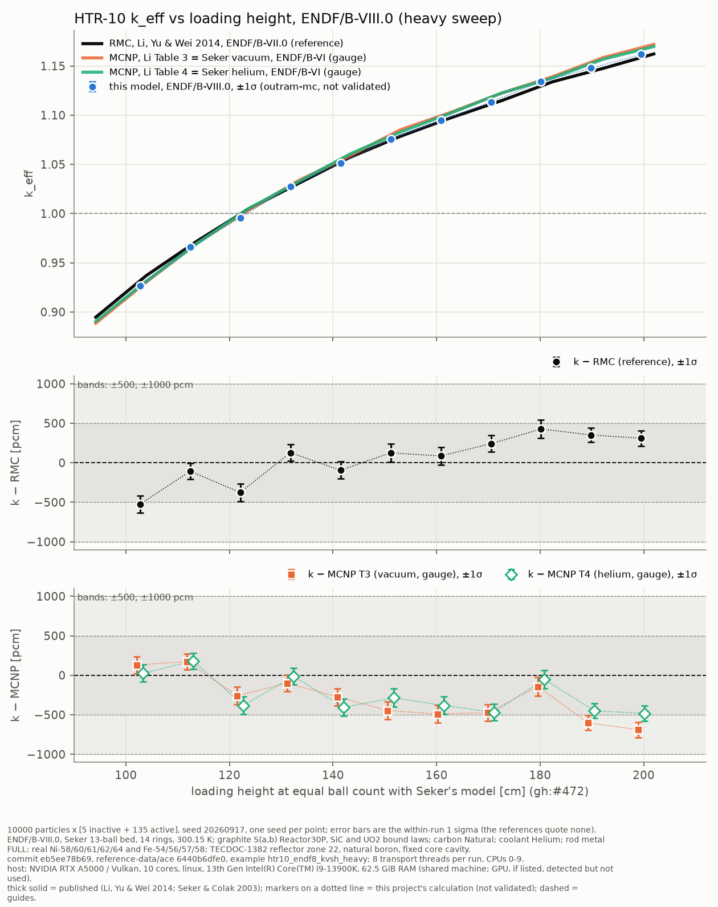

# HTR-10 k against loading height, ENDF/B-VIII.0, heavy sweep (2026-10-02/03)

<!-- vv-unverified-banner -->
> ⚠️ **Unverified until validated.** One seed per point. Research, education
> and V&V only; not for any operational use. AI-assisted run and write-up
> (Claude Opus 5.5 in Claude Code), not yet reviewed by the maintainer.

**Generated:** 2026-10-02 19:24 to 2026-10-03 01:52 (+08:00), by
`crates/nee_soon/examples/htr10_endf8_kvsh_heavy.rs` (gh:#501), built from
`develop` + `eb5ee78b69` with a clean tracked tree. `reference-data/ace` was
at `6440b6dfe0`.

Files: `keff_vs_height.py` (standalone, data embedded; `python3
keff_vs_height.py` redraws the PNG), `results_table.md`, `RUN_PARAMETERS.md`,
`logs/N<n>.log` (one per height), `logs/stdout.log`, `logs/stderr.log`
(nuclear-data processing), `logs/run_diagnostics.md`.

## Methodology

The same as the quick sweep (`../htr10_endf8_kvsh_quick_2026-10-02/README.md`):
Şeker & Çolak (2003)'s 13-ball bed, N = 10 to 20, `Htr10DataConfig::default()`
on ENDF/B-VIII.0 (30P graphite, SiC and UO2 laws, natural carbon, helium
coolant, full Ni/Fe rod steel), 300.15 K, 14 rings. RMC (Li, Yu & Wei 2014,
ENDF/B-VII.0) is the reference and the MCNP Tables 3 and 4 (Şeker's ENDF/B-VI
runs) are gauges, all read at equal ball count (gh:#472). The pass band is
500 to 1000 pcm against RMC. The library offset (VIII.0 here, VII.0 for RMC)
is not corrected.

- **Statistics:** 10 000 particles × [5 inactive + 135 active] (the
  reference paper's own settings), seed 20260917, one seed per point. σ is the
  within-run 1σ of the active-cycle mean, without seed-to-seed scatter.
- **Hardware:** Intel Core i9-13900K, process pinned to CPUs 0-9, 8 transport
  threads, 62.5 GiB RAM, Linux 7.2.7-arch1-1. CPU only (the RTX A5000 in the
  hardware line was detected, not used). Shared machine: the maintainer had
  cores 10-15.

## Results

| N | ref. height [cm] | k ± 1σ | k − RMC [pcm] | k − MCNP T3 [pcm] | k − MCNP T4 [pcm] | (k − RMC)/σ |
|---|---|---|---|---|---|---|
| 10 | 102.728 | 0.926453 ± 0.001077 | −525 ± 108 | +129 | +25 | −4.87 |
| 11 | 112.409 | 0.966199 ± 0.001008 | −107 ± 101 | +173 | +182 | −1.06 |
| 12 | 122.091 | 0.995663 ± 0.001136 | −376 ± 114 | −259 | −381 | −3.31 |
| 13 | 131.773 | 1.027693 ± 0.001037 | +128 ± 104 | −101 | −14 | +1.23 |
| 14 | 141.454 | 1.051335 ± 0.001085 | −95 ± 109 | −273 | −406 | −0.87 |
| 15 | 151.136 | 1.075658 ± 0.001149 | +125 ± 115 | −446 | −285 | +1.09 |
| 16 | 160.817 | 1.094468 ± 0.001111 | +87 ± 111 | −489 | −383 | +0.78 |
| 17 | 170.499 | 1.113519 ± 0.001034 | +242 ± 103 | −474 | −468 | +2.34 |
| 18 | 180.180 | 1.133894 ± 0.001170 | +427 ± 117 | −143 | −51 | +3.65 |
| 19 | 189.862 | 1.147874 ± 0.000924 | +352 ± 92 | −603 | −450 | +3.81 |
| 20 | 199.543 | 1.161718 ± 0.000964 | +310 ± 96 | −689 | −483 | +3.22 |

The MCNP residuals carry the same ±σ as the RMC column (92 to 117 pcm).

| vs | mean | RMS | max abs | within ±1σ | within ±500 | within ±1000 | slope [pcm/cm] |
|---|---|---|---|---|---|---|---|
| RMC (reference) | +52 | 292 | 525 | 2/11 | 10/11 | 11/11 | +8.3 |
| MCNP T3 (vacuum, gauge) | −288 | 395 | 689 | 1/11 | 9/11 | 11/11 | −7.3 |
| MCNP T4 (helium, gauge) | −247 | 334 | 483 | 3/11 | 11/11 | 11/11 | −4.7 |

- Every height: 1 400 000 histories as planned, **0 lost locates, 0 stuck
  events, 0 negative distances**. Entropy changes by at most 0.033 bits from
  the first cycle to the last (6-bit ceiling).
- **Timing:** 1928 to 2240 s of transport per height on 8 threads (rising with
  N); data processing once, 91.9 s; whole sweep 23 268 s (6 h 28 min).
  Hardware as above. For comparison, the 2026-10-01/02 record took 2379 to
  4137 s per run on 5 threads with three runs sharing the machine.

## Comparison with the 2026-10-02 heavy record

`../htr10_seker_2026_10_01_10k/` ran the same statistics and seed on VIII.0
through `htr10_rmc_keff`, at commit `f888cfd98e`, on 5 threads, three runs at
a time. **All 11 values of k and σ are identical to the six printed
decimals** (checked by script against that record's `results_table.md`), so
every residual and summary statistic above equals that record's VIII.0 row
(mean +52, RMS 292, slope +8.3 pcm/cm against RMC).

What this shows:
- the code changes between `f888cfd98e` and `eb5ee78b69`, including the #486
  geometry move and the refactor into `htr10_rmc::keff_vs_height`, did not
  change any HTR-10 eigenvalue at this precision;
- the eigenvalue does not depend on the thread count (5 then, 8 now), or on
  building the nuclear data once for all heights instead of once per run.

What it does not show: anything about the model's accuracy beyond the
record it repeats. Identical numbers are a reproducibility result, not new
physics evidence.

## Reading

- **All 11 points are inside ±1000 pcm of RMC, 10 of 11 inside ±500.** The
  exception is N = 10 (−525 ± 108 pcm, −4.9σ).
- **The residual against RMC is not noise.** Only 2 of 11 points are within
  1σ of RMC, and the residual rises at +8.3 pcm/cm from below RMC at the
  bottom to 3 to 4σ above it from N = 18 up (gh:#218). The quick sweep found
  +7.8 pcm/cm.
- **Against MCNP the slope has the other sign** (−7.3 and −4.7 pcm/cm). RMC
  rises more slowly with height than both MCNP columns, so part of the drift
  is between the two references; this run cannot say which is right.
  Against MCNP Table 4 (the like-for-like helium coolant) all 11 points are
  inside ±500 pcm.
- **Not done:** multi-seed pooling; N = 9; a VII.0 arm (VIII.0 only, by the
  issue's scope; the VII.0 heavy arm is in `../htr10_seker_2026_10_01_10k/`).
