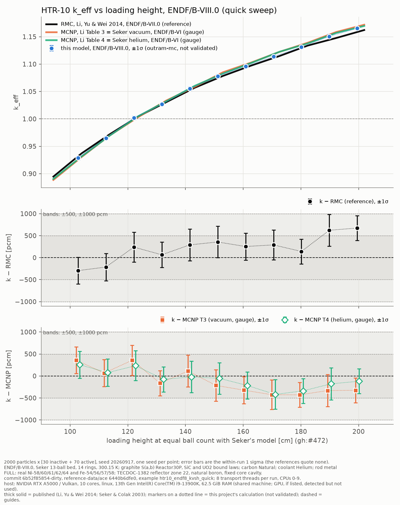

# HTR-10 k against loading height, ENDF/B-VIII.0, quick sweep (2026-10-02)

<!-- vv-unverified-banner -->
> ⚠️ **Unverified until validated.** One seed per point. Research, education
> and V&V only; not for any operational use. AI-assisted run and write-up
> (Claude Opus 5.5 in Claude Code), not yet reviewed by the maintainer.

**Generated:** 2026-10-02, 18:20 to 19:19 (+08:00), by
`crates/nee_soon/examples/htr10_endf8_kvsh_quick.rs` (gh:#501).
**Commit:** the run's binary was built from `develop` at `6b52f85854` with
this commit's code changes uncommitted, so every output says
`6b52f85854-dirty`. The code that ran is the code in the commit that adds
this directory, except one later edit to the reconstruction emitter: it now
strips `-dirty` from the `git checkout` line it writes. `RUN_PARAMETERS.md`
here is the receipt as written and still shows `git checkout
6b52f85854-dirty`; check out the commit that holds this file instead.
`reference-data/ace` was at `6440b6dfe0`.

Files: `keff_vs_height.py` (standalone, data embedded; `python3
keff_vs_height.py` redraws the PNG), `results_table.md`, `RUN_PARAMETERS.md`,
`logs/N<n>.log` (one per height), `logs/stdout.log`, `logs/stderr.log`
(nuclear-data processing), `logs/run_diagnostics.md` (per-item data timings
and the hardware line).

## Methodology

- **Computed:** k_eff of the HTR-10 first-criticality core at Şeker & Çolak
  (2003)'s 13-ball bed, N = 10 to 20 layers (11 heights), every pebble whole
  (gh:#472). Explicit TRISO; hybrid delta tracking in the bed and surface
  tracking elsewhere; TECDOC-1382 reflector zones with the withdrawn rods
  (full Ni/Fe steel); helium coolant at 300.15 K and 101.33 kPa (pressure
  assumed); natural carbon; 30P reactor-graphite, SiC and UO2 bound laws.
  All of this is `Htr10DataConfig::default()` and
  `Htr10MaterialConfig::benchmark_default`. No knob was set.
- **Library:** ENDF/B-VIII.0 only, processed in-process by the NJOY port
  once (90.6 s, 43 items) and reused for every height.
- **Statistics:** 2000 particles × [30 inactive + 70 active], seed 20260917,
  one seed per point. The uncertainty is the within-run 1σ of the
  active-cycle mean. It does not include seed-to-seed scatter, which was
  recorded as 179 to 211 pcm on an earlier version of this model
  (`../../docs/software_engineering/htr10-run-log.md`), about the size of
  these σ.
- **Reference:** RMC, Li, Yu & Wei (2014) (ENDF/B-VII.0). Gauges, not
  references: the paper's MCNP Tables 3 (vacuum) and 4 (helium), which are
  Şeker & Çolak (2003)'s ENDF/B-VI runs on an independent model. Table 4 is
  the like-for-like coolant. Each reference is read where Şeker's model holds
  as many balls as the built bed (gh:#472), by linear interpolation between
  tabulated rows. The curves are the constants in
  `src/htr10_rmc/mod.rs`, written into the script by the emitter.
- **Pass criterion:** the crate's 500 to 1000 pcm band against RMC.
- **Library offset not corrected:** this model runs VIII.0; RMC ran VII.0.
- **Hardware:** Intel Core i9-13900K, process pinned to CPUs 0-9
  (`taskset -c 0-9`, so 10 logical cores visible), 8 transport threads,
  62.5 GiB RAM, Linux 7.2.7-arch1-1 (Arch). Transport on the CPU only; the
  hardware line also names an RTX A5000 GPU, which was detected, not used.
  Shared machine: the maintainer was working on cores 10-15 during the run.

## Results

k ± 1σ and residuals in pcm (k − reference), from `results_table.md`:

| N | ref. height [cm] | k ± 1σ | k − RMC | k − MCNP T3 | k − MCNP T4 | (k − RMC)/σ |
|---|---|---|---|---|---|---|
| 10 | 102.728 | 0.928751 ± 0.003040 | −295 ± 304 | +359 | +255 | −0.97 |
| 11 | 112.409 | 0.965137 ± 0.003096 | −213 ± 310 | +67 | +76 | −0.69 |
| 12 | 122.091 | 1.001820 ± 0.003407 | +240 ± 341 | +357 | +234 | +0.70 |
| 13 | 131.773 | 1.027068 ± 0.002870 | +65 ± 287 | −163 | −76 | +0.23 |
| 14 | 141.454 | 1.055188 ± 0.003593 | +290 ± 359 | +113 | −21 | +0.81 |
| 15 | 151.136 | 1.077973 ± 0.003580 | +357 ± 358 | −214 | −53 | +1.00 |
| 16 | 160.817 | 1.096138 ± 0.003075 | +254 ± 308 | −322 | −216 | +0.82 |
| 17 | 170.499 | 1.114006 ± 0.003367 | +290 ± 337 | −426 | −419 | +0.86 |
| 18 | 180.180 | 1.131035 ± 0.002816 | +141 ± 282 | −429 | −337 | +0.50 |
| 19 | 189.862 | 1.150589 ± 0.003625 | +623 ± 362 | −331 | −178 | +1.72 |
| 20 | 199.543 | 1.165349 ± 0.002819 | +674 ± 282 | −326 | −120 | +2.39 |

The MCNP residuals carry the same ±σ as the RMC column (282 to 362 pcm).

| vs | mean | RMS | max abs | within ±1σ | within ±500 | within ±1000 | slope [pcm/cm] |
|---|---|---|---|---|---|---|---|
| RMC (reference) | +221 | 359 | 674 | 9/11 | 9/11 | 11/11 | +7.8 |
| MCNP T3 (vacuum, gauge) | −120 | 306 | 429 | 5/11 | 11/11 | 11/11 | −7.8 |
| MCNP T4 (helium, gauge) | −78 | 217 | 419 | 9/11 | 11/11 | 11/11 | −5.2 |

- Every height: 200 000 histories as planned, **0 lost locates, 0 stuck
  events, 0 negative distances**. Entropy moves by at most 0.06 bits
  between the first and last cycle, against a 6-bit ceiling (per-height traces in `logs/`).
- **Timing:** 278 to 331 s of transport per height on 8 threads; whole sweep
  3499 s (58 min), data processing included. Hardware as above.

## Reading

- **All 11 points are inside ±1000 pcm of RMC, and 9 of 11 inside ±500.**
  The two outside ±500 are N = 19 (+623 ± 362, 1.7σ) and N = 20
  (+674 ± 282, 2.4σ).
- **The upward drift against RMC is here too:** +7.8 pcm/cm, against +8.3
  pcm/cm in the 10 000-history VIII.0 record (`../htr10_seker_2026_10_01_10k/`).
  At this σ no single point resolves it; the slope over 11 points is what
  carries it (gh:#218).
- **Against MCNP the slope has the other sign** (−7.8 and −5.2 pcm/cm), as in
  the 10k record. The two references disagree with each other in slope, so
  part of the drift is between the references. This run cannot say which one
  is right.
- **Reproducibility check (passed).** N = 10, 12 and 20 were also run on
  2026-10-01 at the same statistics and seed through `htr10_rmc_keff`
  (`../htr10_seker_2026_10_01/logs/run_e8_N{10,12,20}.log`), on a different
  machine (4-core Xeon, 15.7 GiB, `ThreadCount::Auto`, so at most 4 threads)
  and an older commit. All three agree to every printed digit: 0.928751 ±
  0.003040, 1.001820 ± 0.003407 and 1.165349 ± 0.002819. So the shared
  machinery reproduces `htr10_rmc_keff`, and the result did not depend on the
  thread count (4 or fewer then, 8 now) or on the commits in between,
  including the #486 geometry move.
- **Not done here:** multi-seed pooling; N = 9 (its equal-ball-count height
  falls below RMC's table); any VII.0 arm (the heavy and quick examples are
  VIII.0 only, by the issue's scope).
