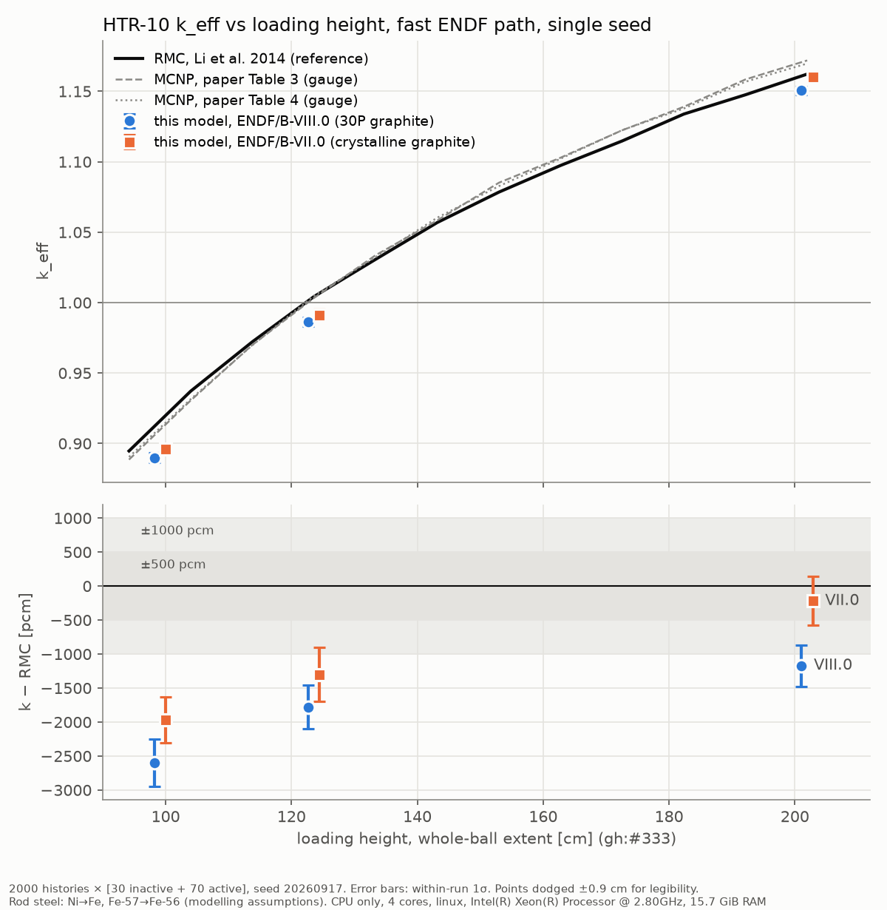

# HTR-10 k vs height on the fast ENDF path (2026-09-28)

<!-- vv-unverified-banner -->
> ⚠️ **Unverified until validated.** Single seed per point, fast-testing
> statistics. Tentative in the sense of gh:#336. Not for any operational use.

## What was run

- **Code:** branch `claude/htr10-geometry-verification-gsg8jx` after merging
  `develop` (27b35d4) and `claude/neutronics-runs-handoff-8xk972` (b9aa483).
  The second merge brings in the **fast ENDF path**, which is not yet on
  `develop`: the RECONR O(N²) fix (9cde161) and `SpeedTier::Fast` as the
  default nuclide lookup (6a13c51). `Nuclide::from_endf_file` takes Fast by
  default, so `examples/htr10_rmc_keff.rs` needed no change.
- **Model:** `assemble_explicit_triso`, 14 rings. Two-ball bed, explicit
  reflector, withdrawn rods in, side-wall balls clipped (gh:#331). Heights are
  n = 20, 25 and 41 layers, i.e. 99.081, 123.576 and 201.960 cm in the paper's
  whole-ball-extent convention (gh:#333).
- **Libraries:**
  - ENDF/B-VIII.0 with the default **30P reactor-graphite** S(α,β).
  - ENDF/B-VII.0 (`OUTRAM_HTR10_ENDF7=1`). Its only graphite law is
    crystalline, and it has no SiC law.
  - Both use rod steel Ni→Fe and Fe-57→Fe-56 (modelling assumptions, see the
    fast-ablation record).
- **Statistics:** 2000 × [30 inactive + 70 active], seed 20260917, cross
  sections at 300.15 K.
- **Reference:** Li, Yu & Wei (2014) RMC, height-matched. MCNP Tables 3 and 4
  are plotted as a gauge only.
- **Hardware:** Intel Xeon @ 2.80 GHz, 4 cores, 15.7 GiB RAM, CPU only, Linux,
  all cores used. **This is a different container from the 2.10 GHz one used
  for the 2026-09-26/27 runs, so absolute times are not comparable across the
  two.**
- **Reproduce:** `plot_keff_vs_height.py <log dir> <out.png>` reads the run
  logs, and reads the reference curves from `src/htr10_rmc/mod.rs`.

## Results

| n | height [cm] | lib | k | k − RMC [pcm] | data [s] | transport [s] |
|---|---|---|---|---|---|---|
| 20 | 99.081 | VIII.0 | 0.889959 ± 0.003482 | −2595 | 224.4 | 574.3 |
| 20 | 99.081 | VII.0 | 0.896220 ± 0.003353 | −1969 | 129.9 | 582.2 |
| 25 | 123.576 | VIII.0 | 0.986496 ± 0.003220 | −1779 | 235.8 | 608.7 |
| 25 | 123.576 | VII.0 | 0.991282 ± 0.003948 | −1300 | 130.7 | 609.0 |
| 41 | 201.960 | VIII.0 | 1.150524 ± 0.003050 | −1170 | 223.9 | 666.4 |
| 41 | 201.960 | VII.0 | 1.160033 ± 0.003605 | −220 | 129.9 | 664.6 |

Every run had 0 lost locates, 0 stuck events and 0 negative distances.

## Reading

- **The fast path is exact on VIII.0.** At n = 25 it reproduces the pre-merge
  30P run of 2026-09-27 (0.986496 ± 0.003220) to every printed digit.
- **U-238 reconstruction got faster, U-235 did not.** Per nuclide, U-238 took
  183.5 s before and 47.5 s after (3.9×). That is far more than the 1.33×
  clock ratio between the two hosts, and matches the fix branch's own
  measurement. U-235 went from 83.7 s to 62.9 s, which is the clock ratio
  alone. Whole-run data processing was 382.6 s before and 235.8 s after, on
  different hosts.
- **The height drift persists** on both libraries: about +14 pcm/cm on VIII.0
  and +17 pcm/cm on VII.0 from 99 to 202 cm (single seed, three points). This
  matches the fast-ablation record's +13.2 ± 4.0 pcm/cm (gh:#218).
- **VII.0 − VIII.0** is +626, +479 and +951 pcm (±480–520). VIII.0 now carries
  30P graphite, which is worth +705 ± 86 pcm. Removing that from the recorded
  library term (+965 ± 91 pcm, crystalline) predicts about +260 pcm. The
  measured values agree with that within 0.4–1.4σ.
- **Only VII.0 at 201.96 cm is inside the 500 pcm band.** Everything else is
  1000–2600 pcm low.

## A VII.0 reproducibility question

With identical inputs, seed and statistics, VII.0 gives 0.991282 at n = 25
against 0.991456 on 2026-09-26, and 0.896220 at n = 20 against 0.893254. The
differences (−17 and +297 pcm) are well inside one σ, but identical inputs
should reproduce bit for bit. VIII.0 does. To tell whether the fast-path merge
or an earlier commit moved VII.0, the pre-merge commit b082d33 is being
rebuilt and re-run on VII.0 at n = 25. The result is recorded below.
