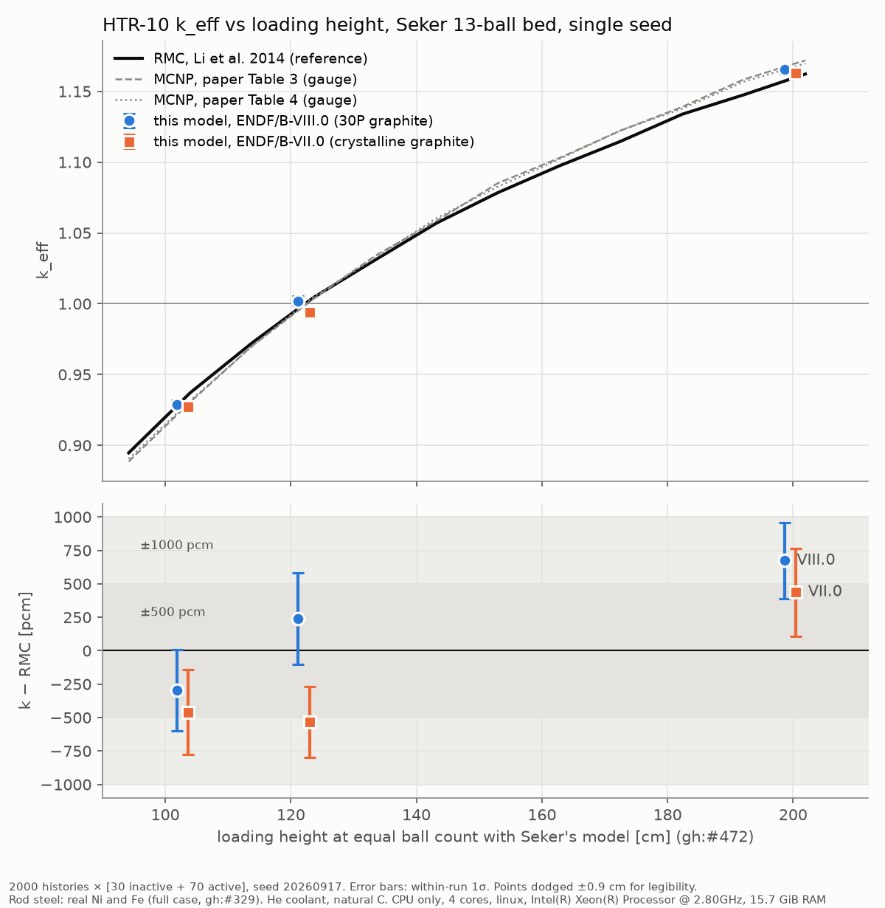

# HTR-10 k vs height on Şeker's 13-ball bed, ENDF/B-VIII.0 and VII.0 (2026-10-01)

<!-- vv-unverified-banner -->
> ⚠️ **Unverified until validated.** Single seed per point, fast-testing
> statistics. Tentative in the sense of gh:#336. Research, education and V&V
> only; not for any operational use.

> **SUPERSEDED 2026-10-07** by `../htr10_seker_2026_10_07/`, re-run with
> identical settings after the delta-tracking fixes (#589, #719, #720, #721).
> VIII.0 moved down by 675 to 809 pcm at every height (now −999, −434,
> −135 pcm vs RMC); VII.0 moved by +150, +236, −660 pcm. The numbers below
> stand as what this code produced on 2026-10-01; do not quote them as
> current, and the close MCNP agreement read below did not survive.

The VIII.0-only plot taken before the VII.0 arm finished is
`keff_vs_height_endf8_2026_10_01.png`.

## Methodology

- **Code:** `develop` at `8c80ab67` (Fe-57 reconstructs, gh:#339 fixed; the
  full rod-metal case is the default). Example `examples/htr10_rmc_keff.rs`,
  release build.
- **Geometry check first:** `cargo test --release -p nee_soon --test
  htr10_geometry_integrity`: **4 passed, 0 failed**
  (`logs/geometry_integrity.log`). The geometry images were regenerated on
  2026-10-01 in `../htr10_geometry_images/` ~~and `../htr10_python_plots/`~~
  **CORRECTED 2026-10-02**: `../htr10_python_plots/` still held the
  2026-09-26 two-ball images at the time; it was regenerated for the 13-ball
  bed on 2026-10-02. They were not regenerated for this run, and the
  geometry did not change.
- **Model:** `assemble_explicit_triso`, 14 rings, Şeker & Çolak (2003)
  13-ball cell (every pebble whole, gh:#472), explicit TECDOC-1382 reflector
  with the withdrawn rods in, helium coolant (gh:#426), natural carbon
  (gh:#425), real Ni and Fe in the rod steel (gh:#329).
- **Heights:** Şeker layers N = 10, 12, 20, built at `9.798 N + 6` cm
  (103.980, 123.576, 201.959 cm). N = 9 was not run: at equal ball count its
  reference height falls below RMC's lowest tabulated point (94.182 cm).
- **Reference:** Li, Yu & Wei (2014) RMC, read at the height where Şeker's
  model holds the same number of balls as the built bed (gh:#472). MCNP
  Tables 3 and 4 are a gauge only; they are Şeker's own ENDF/B-VI runs.
- **Libraries:**
  - VIII.0: 30P reactor-graphite S(α,β), SiC and UO2 laws.
  - VII.0 (`OUTRAM_HTR10_ENDF7=1`): crystalline graphite (its only law), no
    SiC law; **helium and every rod metal are VIII.0 tapes** (no VII.0 tape
    in the checkout), as the logs state.
- **Statistics:** 2000 histories × [30 inactive + 70 active], seed 20260917,
  hybrid delta/surface tracking, 300.15 K.
- **Command:** `OUTRAM_HTR10_RINGS=14 OUTRAM_HTR10_LAYERS=<N>
  [OUTRAM_HTR10_ENDF7=1] ./target/release/examples/htr10_rmc_keff`.
- **Hardware:** Intel Xeon @ 2.80 GHz, 4 cores, 15.7 GiB, CPU only, Linux.
- **Pass criterion:** the crate's 500 to 1000 pcm band against RMC.
- **Reproduce the plot:** `python3 plot_keff_vs_height.py logs <out.png>`.
  It reads the reference curves from `src/htr10_rmc/mod.rs`.

## Results

| N | ref. height [cm] | lib | k | RMC there | k − RMC [pcm] | k − MCNP T3 / T4 [pcm] |
|---|---|---|---|---|---|---|
| 10 | 102.728 | VIII.0 | 0.928751 ± 0.003040 | 0.931700 | −295 ± 304 | +359 / +255 |
| 12 | 122.091 | VIII.0 | 1.001820 ± 0.003407 | 0.999419 | +240 ± 341 | +357 / +234 |
| 20 | 199.543 | VIII.0 | 1.165349 ± 0.002819 | 1.158614 | +674 ± 282 | −326 / −120 |
| 10 | 102.728 | VII.0 | 0.927110 ± 0.003165 | 0.931700 | −459 ± 317 | +195 / +91 |
| 12 | 122.091 | VII.0 | 0.994089 ± 0.002653 | 0.999419 | −533 ± 265 | −416 / −539 |
| 20 | 199.543 | VII.0 | 1.162993 ± 0.003286 | 1.158614 | +438 ± 329 | −561 / −355 |

- Every run: 0 lost locates.
- Data processing: 199 to 219 s on VIII.0, 119 to 122 s on VII.0.
- Transport: 845 to 1013 s per run.

## Reading

- **All six points are inside ±1000 pcm of RMC; four are inside ±500 pcm.**
  This morning's first run on this bed, before helium coolant, natural
  carbon, real rod metal and ball-count matching became the default, was
  −1724 ± 302 pcm at N = 12 (`outram-mc-libs/.../htr10_rmc/README.md`). That
  change is not decomposed here; no ablation was run.
- **The height drift persists** on both libraries. From N = 10 to N = 20 the
  residual rises by +969 pcm on VIII.0 and +897 pcm on VII.0, about
  +10 pcm/cm (gh:#218).
- **VII.0 − VIII.0** is −164, −773 and −236 pcm (±440, ±430, ±430). The sign
  is now negative, unlike the 2026-09-28 fast-path records, where VII.0 was
  higher. Part of this is expected: VIII.0 carries 30P graphite, recorded as
  worth +705 ± 86 pcm over crystalline. The rest is not resolved at one seed.
- **Against MCNP (gauge)** the VIII.0 points are within about 1.3σ at every
  height. That is a promising sign, not a validation. The VII.0−VIII.0 spread
  at N = 12 is larger than the gap to MCNP, and MCNP used ENDF/B-VI, so the
  agreement may partly be offsetting library effects.
- **Not done:** multi-seed pooling (seed-to-seed sd was about 180 pcm on this
  case before), and the other nine rows of Li's table.
