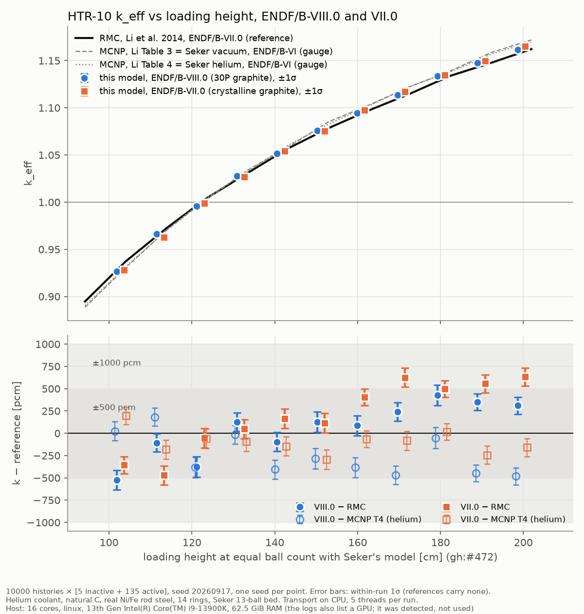

# HTR-10 k vs height at the reference paper's statistics, ENDF/B-VIII.0 and VII.0 (2026-10-01/02)

<!-- vv-unverified-banner -->
> ⚠️ **Unverified until validated.** One seed per point. Tentative in the
> sense of gh:#336. Research, education and V&V only; not for any operational
> use. AI-assisted run and write-up, not yet reviewed by the maintainer.

> ⚠️ **CAUTION, added 2026-10-05 (GitHub #589):** every k in this record was
> measured on a delta-tracking majorant (`bed_majorant`: `over_indices` on a
> 4096-point log grid, margin 0.3) that **under-bounds `Sigma_t` by 14x at 661 eV
> in the UO2 kernel** (13.8x on the VII.0 arm). An under-bound majorant silently
> drops collisions in the U-238 resonances. ~~**Re-measurement is pending; the
> expected shift is −500 to −3000 pcm (k lower) at every height.**~~
> **RE-MEASURED 2026-10-05** in
> [`../htr10_seker_2026_10_05_majorant_fix/`](../htr10_seker_2026_10_05_majorant_fix/README.md),
> at 4 of the 11 heights on VIII.0 and 1 on VII.0, at 10 000 × [5 + 20]. The
> measured shifts (new − old) are −550 ± 281, −10 ± 309, −510 ± 351 and
> −63 ± 259 pcm at N = 10, 14, 17 and 20 (VIII.0; weighted mean
> −263 ± 147 pcm), and −332 ± 316 pcm at N = 14 (VII.0). That is far smaller
> than the −500 to −3000 pcm predicted. The same-code control, VIII.0 N = 14
> on today's code with the old majorant, reproduces this record's k
> (+139 ± 268 pcm), so no other change since this record moved k
> measurably. The numbers below are left as measured on the under-bound majorant. At the 17 points not re-measured,
> read them as carrying a shift of about −300 pcm, known only to about
> ±150 pcm.

**Generated:** runs 2026-10-01 ~18:56 to 2026-10-02 03:01 (+08:00);
**commit:** `f888cfd98e` (`develop`).

Per-library plots: `keff_vs_height_endf8.png`, `keff_vs_height_endf7.png`.
Full tables: `results_table.md` / `results_table.csv`. Everything needed to
rebuild the runs: `RUN_PARAMETERS.md`.

## Methodology

- **What is computed:** k_eff of the HTR-10 first-criticality core against
  loading height, on Şeker & Çolak (2003)'s 13-ball bed, N = 10 to 20 layers
  (11 heights) on each of two libraries, 22 runs in all.
- **Code:** `develop` at `f888cfd98e`, `reference-data/ace` at `6440b6df`.
  Example `examples/htr10_rmc_keff.rs`, release build. Geometry integrity
  test first: **4 passed, 0 failed** (`logs/geometry_integrity.log`). The
  geometry did not change after `../htr10_geometry_images/` was drawn on
  2026-10-01. `../htr10_python_plots/` turned out to still hold the
  2026-09-26 two-ball images, so it was regenerated on 2026-10-02 from the
  same N = 12 bed these runs use (see its README).
- **Statistics:** **10 000 histories × [5 inactive + 135 active]** (140
  cycles), the reference paper's own settings at the maintainer's request.
  Seed 20260917. Earlier records on this bed used 2000 × [30 + 70]
  (`../htr10_seker_2026_10_01/`).
- **Model:** as in `../htr10_seker_2026_10_01/README.md`: 14 rings, explicit
  TRISO, explicit TECDOC-1382 reflector with withdrawn rods, helium coolant,
  natural carbon, real Ni and Fe in the rod steel, 300.15 K.
- **Libraries:** VIII.0 with 30P graphite, SiC and UO2 laws; VII.0
  (`OUTRAM_HTR10_ENDF7=1`) with crystalline graphite and no SiC law, and
  helium and rod metals still from VIII.0 tapes.
- **Reference:** Li, Yu & Wei (2014) RMC (ENDF/B-VII.0), read at the height
  where Şeker's model holds the same number of balls as the built bed
  (gh:#472). MCNP Tables 3 (vacuum) and 4 (helium) are a gauge only: they
  are Şeker's ENDF/B-VI runs on an independent model. Table 4 is the
  like-for-like coolant.
- **Pass criterion:** the crate's 500 to 1000 pcm band against RMC.
- **Hardware:** i9-13900K, 16 cores available, 62.5 GiB, transport on CPU.
  Three runs at a time, 5 threads each, one core left free.

## References

As recorded in `crates/nee_soon/src/htr10_rmc/mod.rs` (no BibTeX is
reconstructed here):

- Li Wanlin, Yu Ganglin & Wei Chunlin, *"Research on Benchmark Calculation
  and Analysis of HTR-10 with RMC Code"*, 7th International Topical Meeting on
  High Temperature Reactor Technology (HTR 2014), Weihai, China, 27-31 October
  2014. RMC curve and the MCNP Tables 3 and 4.
- Şeker, V., Çolak, Ü. (2003), *HTR-10 full core first criticality analysis
  with MCNP*, Nucl. Eng. Des. 222, 263-270,
  doi:10.1016/S0029-5493(03)00031-1, Table 3. Source of the 13-ball bed and
  of the MCNP columns Li reproduces.

## Results

Residuals in pcm, k − reference; σ ≈ 92 to 117 pcm per point (within-run).

| N | VIII.0 − RMC | VII.0 − RMC | VIII.0 − MCNP T4 | VII.0 − MCNP T4 |
|---|---|---|---|---|
| 10 | −525 | −355 | +25 | +195 |
| 11 | −107 | −471 | +182 | −182 |
| 12 | −376 | −54 | −381 | −60 |
| 13 | +128 | +48 | −14 | −93 |
| 14 | −95 | +165 | −406 | −146 |
| 15 | +125 | +115 | −285 | −295 |
| 16 | +87 | +406 | −383 | −64 |
| 17 | +242 | +626 | −468 | −84 |
| 18 | +427 | +497 | −51 | +18 |
| 19 | +352 | +558 | −450 | −243 |
| 20 | +310 | +634 | −483 | −160 |

Summary over the 11 heights:

| library | vs | mean | RMS | max abs | within ±500 | within ±1000 | slope [pcm/cm] |
|---|---|---|---|---|---|---|---|
| VIII.0 | RMC | +52 | 292 | 525 | 10/11 | 11/11 | +8.3 |
| VIII.0 | MCNP T3 (vacuum) | −289 | 395 | 689 | 9/11 | 11/11 | −7.3 |
| VIII.0 | MCNP T4 (helium) | −247 | 334 | 483 | 11/11 | 11/11 | −4.7 |
| VII.0 | RMC | +197 | 417 | 634 | 8/11 | 11/11 | +11.4 |
| VII.0 | MCNP T3 (vacuum) | −143 | 253 | 456 | 11/11 | 11/11 | −4.3 |
| VII.0 | MCNP T4 (helium) | −101 | 162 | 295 | 11/11 | 11/11 | −1.6 |

- Every run: 1 400 000 histories as planned, **0 lost locates**.
- Data processing 92 to 131 s (VIII.0), 56 to 73 s (VII.0). Transport 2379
  to 4137 s per run. The shortest, VII.0 N = 19, ran last and alone, with
  no other run competing for the CPU.

## Reading

- **All 22 points are inside ±1000 pcm of RMC**, and 18 of 22 inside
  ±500 pcm. Against MCNP Table 4 (helium) all 22 are inside ±500 pcm.
- **The height drift against RMC is still there:** +8.3 pcm/cm on VIII.0 and
  +11.4 pcm/cm on VII.0 (gh:#218). It is not a single-seed artefact: with σ
  now about 100 pcm, VII.0 sits 4 to 6σ above RMC at N = 16 to 20.
- **Against MCNP the drift is small or reversed:** −4.7 pcm/cm (VIII.0) and
  −1.6 pcm/cm (VII.0) against Table 4. The RMC curve itself rises more slowly
  with height than both MCNP curves, so part of the drift is a difference
  between the two references, not only between this model and RMC. This
  does not tell us which reference is right.
- **VII.0 − VIII.0** is +146 pcm on average (range −364 to +384, each ±~150).
  Earlier records had VII.0 below VIII.0 at 2000 histories. VIII.0's 30P
  graphite law is recorded as worth +705 ± 86 pcm over crystalline, so some
  other VII.0-to-VIII.0 data difference must be pushing the other way.
  Not decomposed here; no ablation was run.
- **The best agreement is VII.0 against MCNP Table 4** (RMS 162 pcm). Read
  that with care: MCNP used ENDF/B-VI with TMCCS graphite on an independent
  model, so agreement can come partly from cancelling library effects.
- **Not done:** multi-seed pooling; N = 9 (its equal-ball-count height falls
  below RMC's lowest tabulated point).
