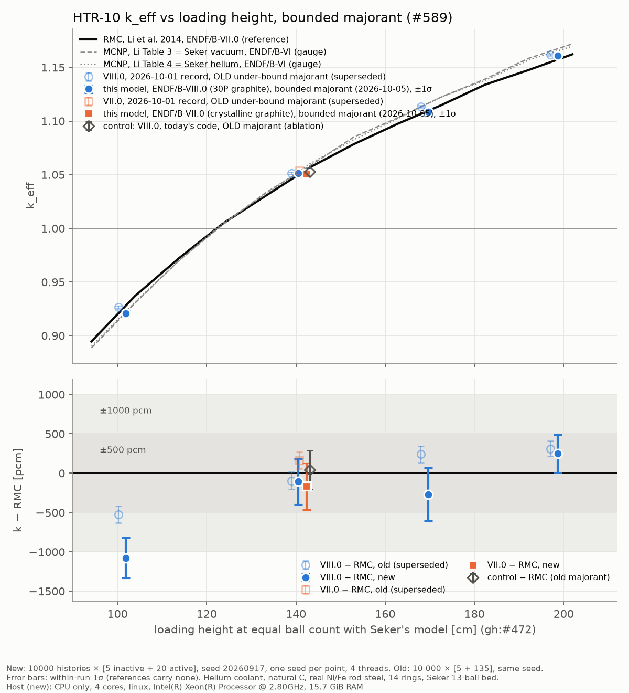

# HTR-10 k vs height on the bounded majorant (2026-10-05, GitHub #589)

<!-- vv-unverified-banner -->
> ⚠️ **Unverified until validated.** One seed per point, reduced statistics
> (10 000 × [5 + 20], σ ≈ 240 to 340 pcm). Research, education and V&V only;
> not for any operational use. AI-assisted run and write-up, not yet reviewed
> by the maintainer.

**Generated:** runs 2026-10-05 11:25 to 15:13 UTC. **Commit:** `develop`
at `e09030a3cf`, which contains the majorant fix `b208cecc7`; the binary also
carries the ablation knob committed in `28eb371b9`. `RUN_PARAMETERS.md` has
everything needed to rebuild the runs. The full tables are
`results_table.md`/`.csv`, `shift_table.md`/`.csv` and `summary.md`.
`plot_keff_vs_height.py` writes all of them from the logs in `logs/` and from
the old record's own `results_table.csv`; no number is retyped.

This record **re-measures 4 of the 11 heights on ENDF/B-VIII.0, and 1 of the
11 on ENDF/B-VII.0**, from
[`../htr10_seker_2026_10_01_10k/`](../htr10_seker_2026_10_01_10k/) (the
"old record"). That record used a delta-tracking majorant, which `b208cecc7`
fixed. **The other 7 VIII.0 points and 10 VII.0 points were not re-measured.**
They keep their old values, which were measured on the under-bound majorant.

## Why

The old record's bed majorant under-bounded `Sigma_t`. The majorant is
`nee_soon::htr10_rmc::keff_vs_height::bed_majorant`, which calls
`Majorant::over_indices` on a 4096-point log grid with margin 0.3. In the UO2
kernel it was low by **14.04× at 661.2 eV on VIII.0**, and by 13.79× on
VII.0. The audit is in
[#589](https://github.com/theodoreOnzGit/outram-park-backend/issues/589#issuecomment-5992542483).

Delta tracking clamps `p_real` at 1. So wherever `Sigma_t > Sigma_maj`, the
collision rate silently becomes `Sigma_maj`. After the fix, the same audit on
the binary these runs used gives a worst `Sigma_t/Sigma_maj` of **0.7696 on
VIII.0 and 0.7697 on VII.0**. The majorant is now bounded everywhere
(`logs/majorant_audit_e{8,7}.log`).

## Prediction, posted before any re-measurement

The prediction was posted on #589 at 2026-10-05 10:21 UTC and is quoted here
unedited:

- **k goes down at every height**, by −500 to −3000 pcm;
- the central guess is about −1500 pcm;
- the shift is roughly uniform with height.

The reasoning was that U-238 resonance capture in the narrow peaks above
~100 eV had been under-counted.

## Methodology

- **What is computed:** k_eff of the HTR-10 first-criticality core, with the
  bounded majorant.
  - The loading heights are N = 10, 14, 17 and 20 Şeker layers on VIII.0,
    and N = 14 on VII.0.
  - The model, seed and particles per cycle are the old record's.
  - The quantities of interest are the **shift**, new − old, at each N, and
    the new residual against RMC.
- **Same-code control:** VIII.0 at N = 14, on today's code, with
  `OUTRAM_HTR10_MAJORANT_WITHOUT_BREAKPOINTS=1`.
  - That knob is the ablation back to the pre-#589 log-grid majorant,
    `Majorant::over_indices_without_breakpoints`.
  - It separates the majorant's effect from everything else that changed
    since the old record: other code changes between `f888cfd98e` and
    `e09030a3cf`, the toolchain and the hardware.
  - If the majorant is the only thing that moved k, the control reproduces
    the old record's k at N = 14 within statistics.
- **Statistics, and why they are reduced:** **10 000 histories × [5 inactive
  + 20 active]**, where the old record ran [5 + 135].
  - A 4-thread pilot (`logs/pilot/`) measured 7.35 ms wall per history on
    this host. At that rate the old record's 1.4 M histories would take about
    2.9 h per point, against a budget of about 3.5 h for all runs.
  - The particles per cycle, the 5 inactive cycles and the seed (20260917)
    are the same as the old record's.
  - The histories diverge from the old record's from the first flight
    anyway, because the majorant sets every flight distance.
- **Model:** unchanged from the old record:
  - 14 rings and explicit TRISO;
  - the TECDOC-1382 reflector with the rods withdrawn;
  - helium, natural carbon, and real Ni and Fe in the rod steel;
  - 300.15 K;
  - hybrid tracking, with delta tracking in the bed.
- **Reference:** Li, Yu & Wei (2014) RMC (ENDF/B-VII.0).
  - It is read at the height where Şeker's model holds the same number of
    balls as the built bed (gh:#472).
  - MCNP Tables 3 (vacuum) and 4 (helium) are a gauge only.
- **Pass criterion:**
  - against RMC, the crate's 500 to 1000 pcm band;
  - for the shift, the significance (new − old)/σ_combined, where
    σ_combined = √(σ_new² + σ_old²).
- **Hardware:**
  - Intel Xeon Processor @ 2.80 GHz, 4 cores, 15.7 GiB, Linux 6.18.44, CPU
    only, Rust 1.94.1.
  - One run at a time, 4 threads pinned to cores 0–3 (`taskset -c 0-3`).
  - The old record ran on an i9-13900K with Rust 1.98.0.

## Results

### New points (bounded majorant)

### ENDF/B-VIII.0

| N | built [cm] | ref. height [cm] | k ± 1σ | RMC | MCNP T3 (vac) | MCNP T4 (He) | k − RMC [pcm] | k − T3 [pcm] | k − T4 [pcm] | (k − RMC)/σ |
|---|---|---|---|---|---|---|---|---|---|---|
| 10 | 103.980 | 102.728 | 0.920948 ± 0.002599 | 0.931700 | 0.925158 | 0.926201 | -1075 ± 260 | -421 | -525 | -4.14 |
| 14 | 143.171 | 141.454 | 1.051235 ± 0.002896 | 1.052285 | 1.054062 | 1.055396 | -105 ± 290 | -283 | -416 | -0.36 |
| 17 | 172.565 | 170.499 | 1.108423 ± 0.003351 | 1.111103 | 1.118263 | 1.118197 | -268 ± 335 | -984 | -977 | -0.80 |
| 20 | 201.959 | 199.543 | 1.161085 ± 0.002409 | 1.158614 | 1.168607 | 1.166548 | +247 ± 241 | -752 | -546 | +1.03 |

### ENDF/B-VII.0

| N | built [cm] | ref. height [cm] | k ± 1σ | RMC | MCNP T3 (vac) | MCNP T4 (He) | k − RMC [pcm] | k − T3 [pcm] | k − T4 [pcm] | (k − RMC)/σ |
|---|---|---|---|---|---|---|---|---|---|---|
| 14 | 143.171 | 141.454 | 1.050621 ± 0.002977 | 1.052285 | 1.054062 | 1.055396 | -166 ± 298 | -344 | -477 | -0.56 |

### Shift, new − old, and the control

| library | N | old k ± 1σ | new k ± 1σ | new − old [pcm] | combined σ [pcm] | (new − old)/σ | old − RMC | new − RMC | new − MCNP T3 | new − MCNP T4 |
|---|---|---|---|---|---|---|---|---|---|---|
| VIII.0 | 10 | 0.926453 ± 0.001077 | 0.920948 ± 0.002599 | -550 | 281 | -1.96 | -525 | -1075 | -421 | -525 |
| VIII.0 | 14 | 1.051335 ± 0.001085 | 1.051235 ± 0.002896 | -10 | 309 | -0.03 | -95 | -105 | -283 | -416 |
| VIII.0 | 17 | 1.113519 ± 0.001034 | 1.108423 ± 0.003351 | -510 | 351 | -1.45 | +242 | -268 | -984 | -977 |
| VIII.0 | 20 | 1.161718 ± 0.000964 | 1.161085 ± 0.002409 | -63 | 259 | -0.24 | +310 | +247 | -752 | -546 |
| VII.0 | 14 | 1.053938 ± 0.001072 | 1.050621 ± 0.002977 | -332 | 316 | -1.05 | +165 | -166 | -344 | -477 |
| VIII.0 control (old majorant, today's code) | 14 | 1.051335 ± 0.001085 | 1.052725 ± 0.002448 | +139 | 268 | +0.52 | -95 | +44 | -134 | -267 |

Read the last row as the **control**, VIII.0 N = 14 on today's code with
the old majorant (`OUTRAM_HTR10_MAJORANT_WITHOUT_BREAKPOINTS=1`):

- **Control − old record = +139 ± 268 pcm (+0.5σ).** Today's code,
  toolchain and host, run on the old majorant, reproduce the old record's k
  within statistics. Nothing else that changed since `f888cfd98e` moved k
  measurably.
- **New − control = −149 ± 379 pcm (−0.4σ).** At N = 14 this isolates the
  majorant's effect. It agrees with zero, and with the mean shift below. It
  is 3.6σ from the predicted central −1500 pcm.
- The control and the new run share the seed, but their histories diverge
  from the first flight, because the majorant sets every flight distance. So
  they are treated as independent.

### Summary

| library | points | weighted mean shift [pcm] | ±1σ | χ² / dof about the mean |
|---|---|---|---|---|
| VIII.0 | 4 | -263 | 147 | 2.81 / 3 |
| VII.0 | 1 | -332 | 316 | n/a |

| library | which | vs | mean [pcm] | RMS [pcm] | max abs [pcm] | within ±500 | within ±1000 |
|---|---|---|---|---|---|---|---|
| VIII.0 | new (bounded) | RMC | -300 | 570 | 1075 | 3/4 | 3/4 |
| VIII.0 | new (bounded) | MCNP T3 | -610 | 669 | 984 | 2/4 | 4/4 |
| VIII.0 | new (bounded) | MCNP T4 | -616 | 652 | 977 | 1/4 | 4/4 |
| VIII.0 | old, same N | RMC | -17 | 331 | 525 | 3/4 | 4/4 |
| VIII.0 | old, same N | MCNP T3 | -327 | 445 | 689 | 3/4 | 4/4 |
| VIII.0 | old, same N | MCNP T4 | -333 | 393 | 483 | 4/4 | 4/4 |
| VII.0 | new (bounded) | RMC | -166 | 166 | 166 | 1/1 | 1/1 |
| VII.0 | new (bounded) | MCNP T3 | -344 | 344 | 344 | 1/1 | 1/1 |
| VII.0 | new (bounded) | MCNP T4 | -477 | 477 | 477 | 1/1 | 1/1 |
| VII.0 | old, same N | RMC | +165 | 165 | 165 | 1/1 | 1/1 |
| VII.0 | old, same N | MCNP T3 | -12 | 12 | 12 | 1/1 | 1/1 |
| VII.0 | old, same N | MCNP T4 | -146 | 146 | 146 | 1/1 | 1/1 |

- **Weighted mean shift over all 5 points: −275 ± 133 pcm** (−2.1σ from zero).
- **Real collisions per history barely moved.** The old → new values per
  history were:
  - VIII.0: 327.62 → 328.17 (N = 10), 303.36 → 303.28 (14),
    290.82 → 291.32 (17) and 281.37 → 280.36 (20);
  - VII.0: 318.42 → 318.53 (N = 14);
  - the control: 303.34.

  Virtual collisions per history rose by 1.5 to 2.1 %: at VIII.0 N = 14
  they went from 9148 to 9315, and the control gives 9136.
  The majorant rose only in narrow windows around resonance
  peaks.
- **Every run:** 250 000 histories as planned, **0 lost locates**.
  - Data processing took 181 to 301 s and transport 1645 to 1942 s.
  - The control's transport took 3188 s, because release builds and a test
    compile shared its 4 cores. Its wall time is not comparable with the
    others; its k is.
  - Peak RSS (VmHWM) was 322 to 604 MiB.

## Verdict against the prediction

| | predicted | measured |
|---|---|---|
| sign | k down at every height | down at all 5 points; 2 of them indistinguishable from zero (−10 ± 309, −63 ± 259) |
| size | −500 to −3000 pcm, central about −1500 | **−263 ± 147 pcm** (VIII.0 mean), −275 ± 133 over all 5 |
| height dependence | roughly uniform | consistent with uniform (χ² = 2.81 for 3 dof about the VIII.0 mean) |
| attribution | the majorant | consistent: the old majorant on today's code gives back the old k (+139 ± 268), so nothing else moved k measurably; the majorant's own effect at N = 14 is −149 ± 379 |

**The prediction MISSED on magnitude.** The measured mean lies 1.6 to 1.7σ above
the low end of the predicted range, so outside the range, and **8 to 9σ
from its central value**. The
sign is right, and so is the flat height dependence, but at the stated
statistics neither is a strong test.

Why the estimate was too large, as far as this record shows:

- The audit measured only the *worst* ratio, 14× at a single U-238
  resonance near 661 eV. It never measured how much of the collision rate
  sat in the under-bound windows.
- The prediction assumed that a large share of resonance capture sat in
  missed peaks. The unchanged real-collision counts say it did not: the
  windows where `Sigma_t > Sigma_maj` held very little of the flux-weighted
  collision rate in this spectrum.
- The FHR quickstart case moved by −14 880 pcm under the same fix (#578).
  Its majorant had 150 log points and missed the 20.87 eV resonance by 97×,
  a far larger and lower-lying miss. So the size of the shift depends on the
  case, and the worst-ratio number alone does not predict it.

**Which numbers to quote.**

- For the 5 re-measured points, quote the new k: they are the only ones
  measured on a bounded majorant.
- For the 17 points that were not re-measured, the old record's k stand, as
  measured on the under-bound majorant. Read each as about 260 to 280 pcm too
  high, a correction known only to about ±150 pcm.
- No correction has been applied to any old number.

## Residuals against RMC and MCNP

- **VIII.0 at N = 10 is now −1075 ± 260 pcm from RMC (−4.1σ)**, outside the
  crate's ±1000 pcm band. It is the only re-measured point outside it. It was
  −525 ± 108 pcm on the old majorant.
- The other 4 points are within ±500 pcm of RMC: −105, −268 and +247
  (VIII.0), and −166 (VII.0).
- **Height drift against RMC (gh:#218):** the new VIII.0 points run from
  −1075 at N = 10 to +247 at N = 20. That is still low at the bottom and high
  at the top, with a slope of about +12 pcm/cm (least squares over the 4
  points; the old record had +8.3 over 11). With σ ≈ 300 pcm, the drift is neither confirmed
  nor ruled out at its old size.
- **Against MCNP Table 4 (helium)** the new VIII.0 residuals are −525, −416,
  −977 and −546 pcm, a mean of −616. On the old majorant they were within
  ±500 pcm.
- These comparisons are code to code: **verification, not validation.**

## Not done

- **The 7 VIII.0 and 10 VII.0 heights not re-measured.**
- **Full statistics:** 10 000 × [5 + 135] would cost about 2.9 h per point
  on this host.
- **Multi-seed pooling.**
- **A same-code control at another height.**
- **A decomposition of the shift by energy range.** The fraction of
  collisions in the under-bound windows of the old majorant was not measured.
