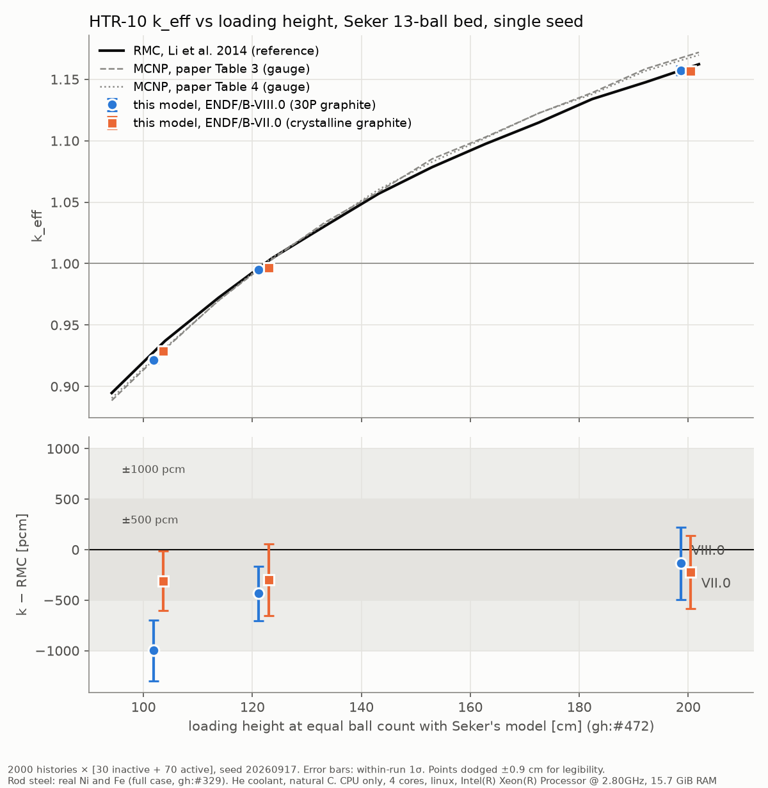

# HTR-10 k vs height on Şeker's 13-ball bed, re-measured after the delta-tracking fixes (2026-10-07)

<!-- vv-unverified-banner -->
> ⚠️ **Unverified until validated.** Single seed per point, fast-testing
> statistics. Tentative in the sense of gh:#336. Research, education and V&V
> only; not for any operational use.

VIII.0 alone: `keff_vs_height_endf8_2026_10_07.png`.

This repeats `../htr10_seker_2026_10_01/` with **identical settings**, so the
two records form a paired before/after comparison. What changed in between is
the code, not the inputs.

## What changed in the code since 2026-10-01

Taken from `git log f888cfd9..7ddcd1fb` over `outram-mc-libs/src` and
`nee_soon/src/htr10_rmc`; the list is what landed, not a decomposition of the
shift:

- #585, #589: the delta-tracking majorant is tabulated on every nuclide
  breakpoint (and WMP pole nodes), so it bounds Σt. The 2026-10-05 record
  (`../htr10_seker_2026_10_05_majorant_fix/`) measured this alone at
  −263 ± 147 pcm on VIII.0 (4 points).
- #598: delta-tracked tallies use the tentative-collision estimator.
- #718: delta tracking moved to `physics::delta_tracking`, bit-identical.
- #719: a void cell inside a delta region is crossed, not lost.
- #720: `keff_delta` collides at the material's temperature, not the run's.
- #721: majorant violations and delta-lost histories are counted.

## Methodology

- **Code:** `develop` at `7ddcd1fb`, `examples/htr10_rmc_keff.rs`, release
  build. During this record the example gained two print lines for the #721
  counters (they were reported only through `log::warn!`, and the example
  installs no logger). VIII.0 N = 12 and N = 10 ran before that change and
  were re-run after it (`logs/rerun_e8_N*.log`): **k identical to every
  printed digit**, which confirms the change is print-only, and both show 0
  violations and 0 delta-lost histories.
- **Geometry check first:** `cargo test --release -p nee_soon --test
  htr10_geometry_integrity`: **4 passed, 0 failed**
  (`logs/geometry_integrity.log`).
- **Model, heights, reference, libraries, statistics, hardware:** exactly as
  in `../htr10_seker_2026_10_01/README.md`: 14 rings, Şeker N = 10, 12, 20,
  RMC read at equal ball count (gh:#472), 2000 histories × [30 inactive + 70
  active], seed 20260917, 300.15 K, full rod metal, helium coolant, natural
  carbon; VII.0 takes helium and the rod metals from VIII.0 tapes. Intel Xeon
  @ 2.80 GHz, 4 cores, 15.7 GiB.
- **Pass criterion:** the crate's 500 to 1000 pcm band against RMC.
- **Reproduce the plot:** `python3 plot_keff_vs_height.py logs <out.png>`.

## Results

| N | ref. height [cm] | lib | k | k − RMC [pcm] | k − MCNP T3 / T4 [pcm] | majorant violations | delta lost |
|---|---|---|---|---|---|---|---|
| 10 | 102.728 | VIII.0 | 0.921709 ± 0.002989 | −999 ± 299 | −345 / −449 | 0 (re-run) | 0 (re-run) |
| 12 | 122.091 | VIII.0 | 0.995074 ± 0.002719 | −434 ± 272 | −318 / −440 | 0 (re-run) | 0 (re-run) |
| 20 | 199.543 | VIII.0 | 1.157261 ± 0.003568 | −135 ± 357 | −1135 / −929 | 0 | 0 |
| 10 | 102.728 | VII.0 | 0.928614 ± 0.002938 | −309 ± 294 | +346 / +241 | 0 | 0 |
| 12 | 122.091 | VII.0 | 0.996453 ± 0.003544 | −297 ± 354 | −180 / −302 | 0 | 0 |
| 20 | 199.543 | VII.0 | 1.156391 ± 0.003604 | −222 ± 360 | −1222 / −1016 | 0 | 0 |

- Every run: 0 lost locates, 0 majorant violations, 0 delta-lost histories.
- Data processing: 231 to 250 s on VIII.0, 139 to 143 s on VII.0.
- Transport: 1047 to 1325 s per run, about 20 % slower than on 2026-10-01
  on the same hardware.

### Shift against 2026-10-01 (same settings, same seed)

| N | VIII.0 shift [pcm] | VII.0 shift [pcm] |
|---|---|---|
| 10 | −704 ± 426 | +150 ± 432 |
| 12 | −675 ± 436 | +236 ± 442 |
| 20 | −809 ± 455 | −660 ± 488 |

## Reading

- **All six points are inside ±1000 pcm of RMC** (VIII.0 N = 10 at the edge,
  −999 pcm); four are inside ±500 pcm.
- **VIII.0 moved down coherently**, by 675 to 809 pcm at every height
  (inverse-variance mean about −727 ± 253 pcm, 2.9σ). That is larger than the
  −263 ± 147 pcm the 2026-10-05 record attributed to the bounded majorant
  alone, so later changes (#719, #720 most plausibly) appear to add to it.
  That attribution is **not tested here**; no ablation was run.
- **VII.0 moved by less** (+150, +236, −660; mean about −52 ± 261 pcm), so
  the two libraries now sit close: VII.0 − VIII.0 is +690, +138 and −87 pcm,
  against −164, −773 and −236 pcm on 2026-10-01.
- **Height drift:** VIII.0 still rises with height, +864 pcm from N = 10 to
  N = 20 (about +9 pcm/cm, gh:#218). VII.0 is now nearly flat, +87 pcm over
  the same range. With one seed per point this difference is not resolved.
- **Consistency with 2026-10-05:** that record's VIII.0 N = 10 at
  10 000 × [5 + 20] was −1075 ± 260 pcm; this one is −999 ± 299.
- **Against MCNP (gauge):** VIII.0 is now 300 to 450 pcm below MCNP at the two
  lower heights and about 1000 pcm below at N = 20. The 2026-10-01 agreement
  with MCNP does not survive the fixes: it was partly carried by transport
  defects fixed since.
- **Not done:** multi-seed pooling, the other nine rows, an ablation splitting
  the shift between #589, #719 and #720.
