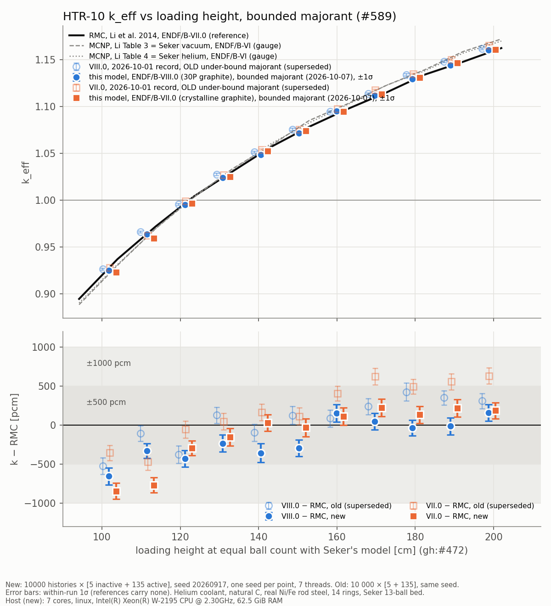

# HTR-10 k vs height, full sweep at 10 000 × [5 + 135] on the bounded majorant (2026-10-07)

<!-- vv-unverified-banner -->
> ⚠️ **Unverified until validated.** One seed per point. Research, education
> and V&V only; not for any operational use. AI-assisted run and write-up
> (Claude Opus 5.5 in Claude Code), not yet reviewed by the maintainer.

**Generated:** runs 2026-10-07 01:59 to 12:34 UTC; **commit:** `dbb9e26e`
(`develop`). Per-library plots: `keff_vs_height_endf8.png`,
`keff_vs_height_endf7.png`. Tables: `results_table.md`/`.csv` (k and
residuals), `shift_table.md`/`.csv` (new − old at every N), `summary.md`.
Everything needed to rebuild the runs: `RUN_PARAMETERS.md`.

**What this record is.** All 22 points of
[`../htr10_seker_2026_10_01_10k/`](../htr10_seker_2026_10_01_10k/README.md)
(N = 10 to 20 on ENDF/B-VIII.0 and VII.0), re-run at **the same statistics**
on the bounded delta-tracking majorant of gh:#589. The 2026-10-01 record was
measured on a majorant under-bound 14× at 661 eV;
[`../htr10_seker_2026_10_05_majorant_fix/`](../htr10_seker_2026_10_05_majorant_fix/README.md)
re-measured only 5 points at [5 + 20]. **This record supersedes both for every
k-vs-height number on the Şeker bed.**

## Methodology

- **Computed:** k_eff of the HTR-10 first-criticality core against loading
  height, Şeker & Çolak (2003) 13-ball bed, N = 10 to 20 layers, on two
  libraries: 22 runs.
- **Code:** `develop` at `dbb9e26e`, `reference-data/ace` at `6440b6df`,
  example `examples/htr10_rmc_keff.rs`, release build. Geometry integrity test
  first: **4 passed, 0 failed** (`logs/geometry_integrity.log`).
- **Geometry unchanged** since the drawn images in
  [`../htr10_geometry_images/`](../htr10_geometry_images/README.md): the code
  changes since the 2026-10-05 record (gh:#566, #580 design/rod-insertion
  plumbing) build the same geometry at the default design, pinned by
  `core_design::tests::the_default_design_builds_the_geometry_unchanged`
  (**passed**, 2026-10-07, on this commit). No new images were drawn.
- **Statistics:** 10 000 histories × [5 inactive + 135 active], the reference
  paper's own settings, seed 20260917, one seed per point. Within-run 1σ.
- **Model:** unchanged from the 2026-10-01 record: 14 rings, explicit TRISO,
  explicit TECDOC-1382 reflector with withdrawn rods, helium coolant, natural
  carbon, real Ni/Fe rod steel, 300.15 K, hybrid tracking (delta in the bed).
- **Reference:** Li, Yu & Wei (2014) RMC (ENDF/B-VII.0), read at the height
  where Şeker's model holds the same number of balls as the built bed
  (gh:#472). MCNP Tables 3 (vacuum) and 4 (helium) are a gauge only.
- **Pass criterion (the crate's):** within ±1000 pcm of RMC; ~500 pcm counts
  as success, since the paper's own RMC-vs-MCNP differences reach ~0.9 %.
- **Prediction,** written before any k was read
  ([`PREDICTION.md`](PREDICTION.md)): new − old ≈ −260 pcm at every N on
  VIII.0 and ≈ −300 pcm on VII.0, no height dependence.

## Results

### 1. The majorant shift, now measured at every height

| library | points | weighted mean new − old [pcm] | ±1σ | χ² / dof about the mean |
|---|---|---|---|---|
| VIII.0 | 11 | **−233** | 45 | 11.0 / 10 |
| VII.0 | 11 | **−310** | 44 | 6.3 / 10 |

**The prediction held:** −233 ± 45 against −260 predicted (VIII.0), −310 ± 44
against −300 (VII.0), and χ²/dof ≈ 1 means no height dependence is resolved.
Per-N shifts are in `shift_table.md`; the largest single shift is −490 ± 140
pcm (VII.0, N = 10). Its −3.5σ in that table is measured from zero shift, not
from the mean; the scatter about the mean is what the χ² column tests, and the
largest deviation from it is 1.9σ (VIII.0 N = 16, +66 against −233).

**Consistency with the 2026-10-05 [5 + 20] points** (same code path,
statistics 2.7× looser): differences this − that are +419 ± 282 (VIII.0 N =
10), −251 ± 313 (14), +317 ± 351 (17), −86 ± 263 (20) and +198 ± 316 pcm
(VII.0 N = 14); χ² = 4.2 for 5 points. They agree.

### 2. Residuals against RMC

ENDF/B-VIII.0 (30P graphite):

| N | ref. height [cm] | k ± 1σ | k − RMC [pcm] | (k − RMC)/σ | k − MCNP T4 [pcm] |
|---|---|---|---|---|---|
| 10 | 102.728 | 0.925141 ± 0.001082 | −656 ± 108 | **−6.1** | −106 |
| 11 | 112.409 | 0.963975 ± 0.000923 | −329 ± 92 | **−3.6** | −41 |
| 12 | 122.091 | 0.995125 ± 0.001055 | −429 ± 106 | **−4.1** | −435 |
| 13 | 131.773 | 1.024086 ± 0.001088 | −233 ± 109 | −2.1 | −374 |
| 14 | 141.454 | 1.048724 ± 0.001191 | −356 ± 119 | −3.0 | −667 |
| 15 | 151.136 | 1.071474 ± 0.001065 | −293 ± 106 | −2.8 | −703 |
| 16 | 160.817 | 1.095127 ± 0.001103 | +152 ± 110 | +1.4 | −317 |
| 17 | 170.499 | 1.111591 ± 0.001044 | +49 ± 104 | +0.5 | −661 |
| 18 | 180.180 | 1.129270 ± 0.001005 | −35 ± 100 | −0.4 | −514 |
| 19 | 189.862 | 1.144219 ± 0.001110 | −14 ± 111 | −0.1 | −815 |
| 20 | 199.543 | 1.160230 ± 0.001066 | +162 ± 107 | +1.5 | −632 |

ENDF/B-VII.0 (crystalline graphite):

| N | ref. height [cm] | k ± 1σ | k − RMC [pcm] | (k − RMC)/σ | k − MCNP T4 [pcm] |
|---|---|---|---|---|---|
| 10 | 102.728 | 0.923248 ± 0.001021 | −845 ± 102 | **−8.3** | −295 |
| 11 | 112.409 | 0.959561 ± 0.000975 | −771 ± 98 | **−7.9** | −482 |
| 12 | 122.091 | 0.996470 ± 0.000924 | −295 ± 92 | **−3.2** | −301 |
| 13 | 131.773 | 1.024913 ± 0.001117 | −150 ± 112 | −1.3 | −292 |
| 14 | 141.454 | 1.052596 ± 0.001045 | +31 ± 104 | +0.3 | −280 |
| 15 | 151.136 | 1.074089 ± 0.001142 | −32 ± 114 | −0.3 | −442 |
| 16 | 160.817 | 1.094713 ± 0.001110 | +111 ± 111 | +1.0 | −359 |
| 17 | 170.499 | 1.113335 ± 0.001132 | +223 ± 113 | +2.0 | −486 |
| 18 | 180.180 | 1.130952 ± 0.001094 | +133 ± 109 | +1.2 | −346 |
| 19 | 189.862 | 1.146546 ± 0.001111 | +219 ± 111 | +2.0 | −582 |
| 20 | 199.543 | 1.160479 ± 0.001014 | +187 ± 101 | +1.8 | −607 |

| library | vs | mean [pcm] | RMS [pcm] | max abs [pcm] | within ±500 | within ±1000 |
|---|---|---|---|---|---|---|
| VIII.0 | RMC | −180 | 308 | 656 | 10/11 | **11/11** |
| VIII.0 | MCNP T4 (He) | −479 | 535 | 815 | 5/11 | 11/11 |
| VII.0 | RMC | −108 | 379 | 845 | 9/11 | **11/11** |
| VII.0 | MCNP T4 (He) | −406 | 422 | 607 | 9/11 | 11/11 |

**Drift with height** (weighted least-squares line through k − RMC against
reference height, within-run σ): **+6.96 ± 1.03 pcm/cm** on VIII.0 (χ² 13.9 /
9 about the line) and **+10.58 ± 1.01 pcm/cm** on VII.0 (χ² 29.0 / 9).

### Interpretation

- **All 22 points are inside the ±1000 pcm band**, 19 of 22 inside ±500 pcm.
  The 2026-10-05 record's one out-of-band point (VIII.0 N = 10, −1075 ± 260
  pcm at [5 + 20]) is −656 ± 108 at full statistics; the two agree at 1.5σ.
- **The misses are real and concentrated at the bottom of the bed.** 3 of 11
  points on each library sit ≥ 3σ from RMC, all at N = 10 to 12, up to 8.3σ
  (VII.0 N = 10). From N = 13 up, every point on both libraries is within 3σ.
- **The height drift (gh:#218) survives the majorant fix**: +7.0 ± 1.0 pcm/cm
  (VIII.0) and +10.6 ± 1.0 (VII.0). The majorant shift is flat in height
  (section 1), so it could not have removed it. A straight line does not
  describe the VII.0 residuals (χ² 29 / 9): they rise steeply from N = 10 to
  13 and flatten above, so the defect is likely a bottom-of-core or
  short-core effect rather than a uniform per-cm one. Not investigated here.
- **Against the like-for-like MCNP column (Table 4, helium)** both libraries
  sit low at every height, −400 to −500 pcm on average; that is a gauge only
  (ENDF/B-VI, different graphite treatment), not a reference.

## What was not done

- One seed per point; seed-to-seed scatter is not measured, only the
  within-run σ (the 2026-10-05 control and this record's agreement with the
  [5 + 20] points are indirect evidence that the within-run σ is honest).
- No new geometry images (geometry unchanged, see Methodology).
- Downstream consumers that read the 2026-10-01 CSV (the `stats::sweep`
  LOO example, the dhoby-ghaut MC web demo) still read it; repointing them is
  filed as a follow-up rather than changed here.
